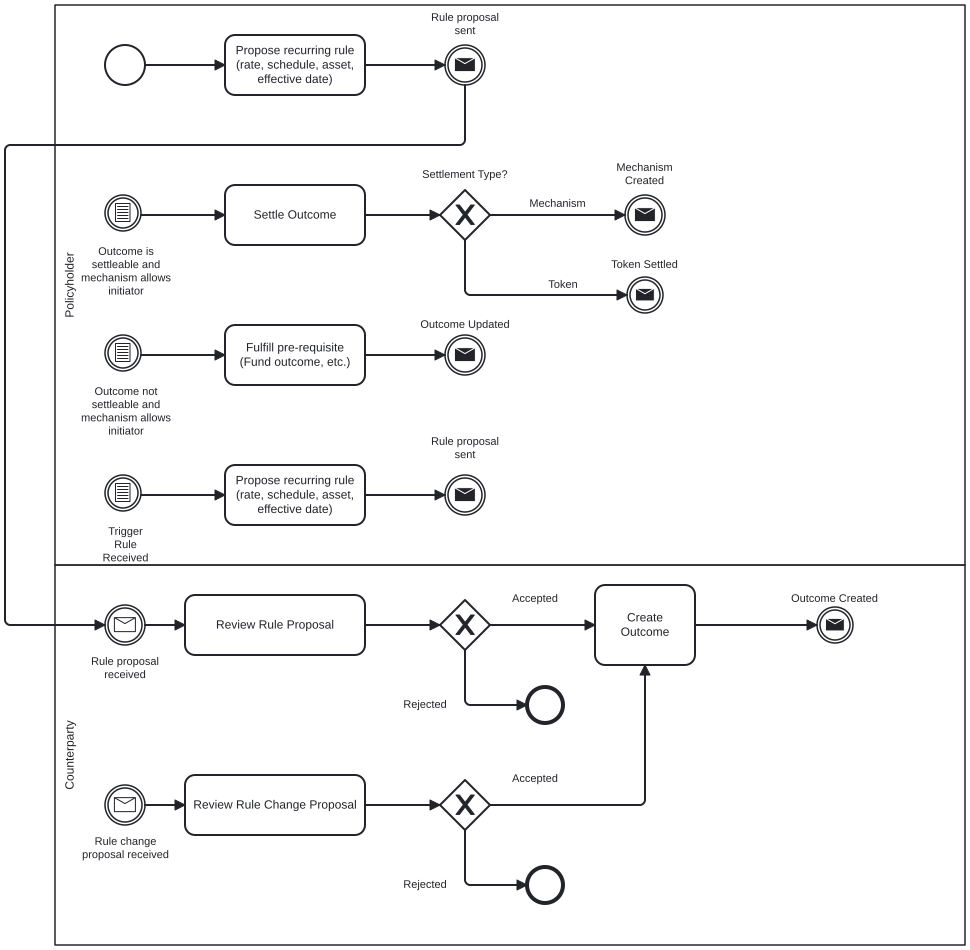
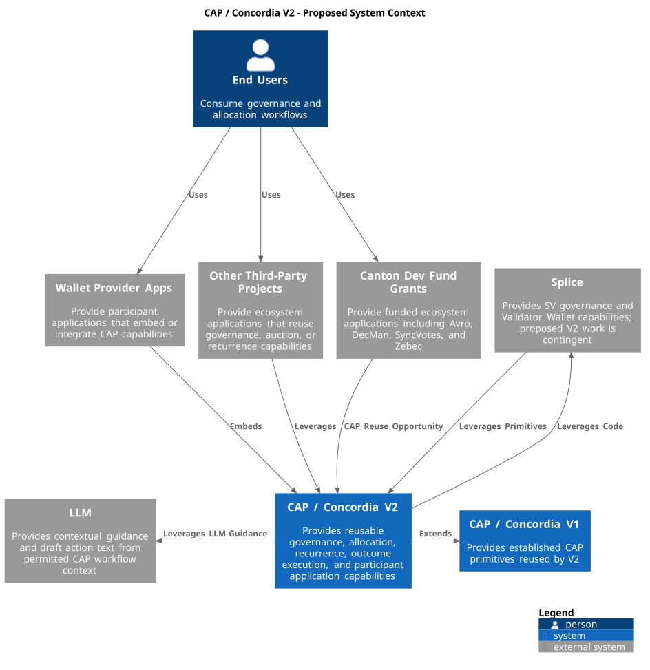
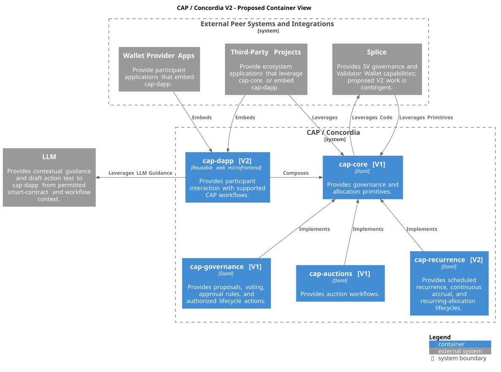

## Development Fund Proposal

**Author:** Unlockit (luis.marado@unlockit.io)  
**Status:** Draft  
**Created:** 2026-08-05  
**Label:** financial-workflows-composability, onchain-governance  
**Champion:** TBD

> **Scope revision (post-9548b47acbe870a3011b8926a88393c9b2966354, “Render Concordia diagrams for GitHub”):** This revision excises Splice SV governance, wallet-provider/Validator Wallet, and Portfolio UI scope. Funding amounts remain unchanged pending review.

---

## Abstract

Concordia V1 made multi-party decisions reusable. Concordia V2 makes the financial obligations produced by those decisions reusable over time.

Concordia V2 extends **Canton Allocation Primitives (CAP)**, the open-source reference implementation established by Concordia V1 for privacy-preserving multi-party allocation and decision workflows on Canton. CAP provides shared submission, resolution, outcome-execution, and expiry mechanics, with governance and auctions as its initial proving domains.

This proposal adds recurring allocations governed by scheduled or continuous rules. Authorized governance actions can initialize, amend, suspend, terminate, or finalize these allocations and produce subsequent or final outcomes through the existing CAP execution model.

The reference application is also extended with a reusable governance and workflow microfrontend that application developers can adopt and extend. Existing contracts, authorization rules, signing flows, and Canton asset infrastructure remain authoritative.

The proposal is additive. It does not replace, reopen, or alter the governance, auction, delivery, or adoption commitments established in Concordia V1.

---

## Specification

### 1. Objective

Extend the reusable CAP V1 reference implementation so developers can model, execute, and evaluate allocations governed by recurring rules without rebuilding the same authorization, time-calculation, lifecycle, and outcome structure from scratch.

V2 should cover a narrow but meaningful class of recurring allocation rules:

- initialization from an authorized agreement or decision
- scheduled recurrence and continuous accrual
- deterministic calculation over an agreed schedule or effective interval
- governance actions that amend, suspend, terminate, or finalize an active recurring allocation
- production of subsequent or final allocations for settlement through existing Canton infrastructure

The intended outcome is that a Canton team can use the shared CAP foundation to build recurring allocation workflows for employment compensation, rent, subscriptions, revenue sharing, vesting, recurring obligations, and treasury distributions. Domain-specific governance determines which participants can act, which routes are available, and how each authorized action affects the recurring allocation and any resulting allocations.

V2 also extends the reference application layer with a reusable governance and workflow microfrontend that Canton ecosystem application developers can adopt, embed, and extend.

This proposal extends CAP V1's shared submission, resolution, outcome execution, and expiry mechanics. It does not replace, reopen, or alter V1 governance, auction, delivery, or adoption commitments.

### 2. Implementation Mechanics

The project extends the CAP V1 implementation with recurring allocations and a reusable reference application.

The descriptions of `cap-core`, `cap-governance`, `cap-recurrence`, and `cap-dapp` below cover V2's active scope. `cap-auctions` remains a V1 reference module with no V2 implementation work planned.

The implementation preserves the modular structure established in V1:

- `cap-core` provides submission, resolution, outcome execution, and expiry mechanics
- `cap-governance` remains the V1 governance-oriented reference implementation, providing proposals, voting, approval rules, and authorized execution
- `cap-auctions` remains the V1 reference proving domain for auctions
- `cap-recurrence` adds allocations governed by recurring rules
- `cap-dapp` provides the open-source reference application for interacting with supported CAP workflows

The names `cap-recurrence` and `cap-dapp` describe proposed logical components. Their final implementation boundaries will be determined during technical design.

#### Core Layer: `cap-core`

The core captures the common structure of allocation workflows on Canton.

| Core capability | Description |
|---|---|
| **Submission workflow** | Each participant submits through a privacy-preserving invite, submit, and close lifecycle. Submissions remain visible only to the submitter and the parties that need to see them. Workflows have deadlines, expired invitations can be reclaimed, and the model remains non-blocking if a participant goes offline. |
| **Resolution rules** | The core exposes pluggable resolution hooks that process collected submissions into an outcome. Domain modules implement their own rules, including auction winner selection, governance approval, and recurring allocation calculations. |
| **Outcome execution** | The workflow produces an executable outcome carrying the authority collected during the workflow. Where the required parties have authorized the resulting action, the outcome can be exercised atomically. Outcome execution may initialize or modify governance state, produce subsequent or final allocations, invoke settlement through existing Canton infrastructure, or trigger another authorized downstream action. |

**Expiry handling**
Deadlines, notice periods, and effective intervals are modeled explicitly. Expired participation paths can be released or reclaimed without changing completed outcomes.

#### Governance Module: `cap-governance`

The governance module remains the governance-oriented reference implementation built on `cap-core`, unless `cap-recurrence` integration identifies a need to extend an existing interface.

Authorized governance actions initialize, amend, suspend, resume, terminate, or finalize a recurring rule. Each action follows the approval rules defined by the applicable workflow and may produce subsequent or final allocations through `cap-core` outcome execution.

It covers:

- proposal creation
- ballot submission
- quorum and approval threshold checks
- weighted voting
- downstream execution after approval

Authorized governance actions on recurring allocations are exercised by `cap-governance` only through `cap-core` interfaces, without redefining existing approval, voting, or execution semantics.

The governance module does not create domain-specific rights. Employment, rental, subscription, or other policies determine who may act, which governance routes are available, and what outcome each route produces.

#### Recurrence Module: `cap-recurrence`

`cap-recurrence` represents CAP allocations governed by recurring rules.

It supports:

- scheduled recurrence and continuous accrual
- agreed rates or schedules
- effective start and end times
- deterministic calculation and rounding
- amendment, suspension, and resumption
- termination and finalization
- subsequent and final allocations

A recurring rule determines how an allocation evolves over time. Governance determines which participants may modify that rule and what outcomes each authorized action produces. Each authorized action follows the approval rules defined by the applicable workflow and produces subsequent or final allocations through `cap-core` outcome execution.

Recurrence does not create domain-specific rights. Employment, rental, subscription, or other policies determine who may act, which governance routes are available, and what outcome each route produces.

Calculated and settled amounts are recorded independently so settlement timing does not change what has already accrued. The module does not introduce a separate token, transfer, or settlement standard.

#### Reference Application: Concordia Dapp (`cap-dapp`)

The Concordia Dapp (`cap-dapp`) is the open-source reference application for interacting with supported CAP workflows.

It provides one reusable governance and workflow microfrontend that application developers can adopt, embed, and extend.

The application:

- presents supported governance and allocation workflows
- shows current state and relevant history
- allows participants to prepare actions available to them
- hands approved actions to the applicable authorization and signing route
- supports `cap-governance`, `cap-recurrence`, and future compatible CAP modules

`cap-dapp` supports two main modes of presentation and interaction:

- **Traditional interaction:** participants inspect governance and allocation activity, receive relevant updates, and initiate or respond to actions through the user interface. The application supports both pull-based access, where participants review current activity, and push-based notifications for proposals, deadlines, state changes, and actions requiring attention.
- **Optional LLM-guided interaction:** participants may choose to enable an LLM-assisted presentation and interaction mode in the Concordia Dapp. When enabled, each participating entity may connect its own LLM and configure its own policies, privacy controls, and operational boundaries. The assistant can summarize activity, explain proposals, compare changes, identify pending actions, and prepare non-binding actions for participant review. This is an optional presentation and interaction mode within the Concordia Dapp; it is not a separately funded workstream and does not alter the canonical authorization or signing boundary.

Both modes use the same CAP workflows and authorization boundaries. Optional LLM-guided interaction does not vote, sign, submit, allocate, or execute on behalf of a participant. Binding actions remain subject to explicit approval and the canonical authorization and signing route.

Contracts, participant authority, approval rules, and signing mechanisms remain authoritative. `cap-dapp` does not grant authority or execute actions on behalf of a participant.

Existing Canton infrastructure remains the settlement and technical context for supported flows. Concordia V2 does not modify or integrate with external system governance or wallet products.

A static advisory participant mockup illustrating the proposed `cap-dapp` reference surface across four focused areas, Core, Governance, Auctions, and Recurrence, is available at [`mockups/concordia-dapp/index.html`](mockups/concordia-dapp/index.html), with design notes in [`mockups/concordia-dapp/README.md`](mockups/concordia-dapp/README.md). It is illustrative only and does not imply a wallet product, route, or upstream integration.

#### Illustrative Execution Flows

**Conceptual sequence: CAP V2 allocation lifecycle**

The allocation lifecycle is illustrated in BPMN at [`assets/bpmn/01-concordia-recurrent-allocation-and-governance.bpmn`](assets/bpmn/01-concordia-recurrent-allocation-and-governance.bpmn) and rendered inline below.

It is illustrative and does not claim implementation, payment execution, or signing authority. Side controls (amend, suspend, resume, terminate) are part of the authorized governance surface described in `cap-recurrence` and are not depicted in the diagram above. The same conceptual sequence applies to the Employment and Rental illustrations below.

**Employment**

1. An employer and worker provide bilateral unanimous approval of an employment agreement.
2. Approval initializes a recurring salary allocation with its rate or schedule, effective date, asset reference, and applicable policy.
3. Salary accrues according to the agreed recurring rule.
4. Authorized governance actions may amend or suspend future accrual.
5. The agreement may end by mutual approval or through a policy-authorized unilateral route.
6. The selected route stops future accrual and may produce final allocations for earned salary, notice, leave, bonus, or severance.
7. Outcome execution invokes settlement through existing Canton infrastructure.

The reference workflow demonstrates configurable mechanics. It does not encode universal employment law or create termination rights independently of the agreement and applicable policy.

**Rental**

1. A landlord and tenant approve an agreement containing its start date and recurring rent terms.
2. Approval initializes the recurring rent allocation.
3. Authorized amendments may change future terms without rewriting settled history.
4. A valid end-of-tenancy route stops future rent accrual.
5. Finalization may produce allocations for outstanding rent and explicitly authorized adjustments.
6. Outcome execution invokes settlement through existing Canton infrastructure.

Deposit handling and disputes remain separate policy workflows unless explicitly implemented by an adopter.

### 3. Architectural Alignment

Concordia V2 is application-layer public infrastructure built on Canton and Daml strengths in multi-party authorization, privacy-aware workflows, deterministic contract state, and auditable lifecycle transitions.

Separating authorization, domain policy, recurring allocation, and settlement keeps each concern replaceable. A bilateral employment agreement can use the same allocation mechanics as a governed treasury distribution while retaining different approval and termination rules. Existing Canton Token Standards remain the settlement boundary.

Concordia V2 defines strict, reusable primitives and documented interfaces while leaving concrete implementation choices to implementors. This common-good approach provides shared, interoperable building blocks without prescribing application-specific workflow implementations; employment and rental remain reference use cases, and `cap-core` and `cap-dapp` retain their stated scopes.

The project aligns with the Development Fund's support for reusable reference implementations and common-good developer infrastructure. Relevant CIPs and ecosystem projects will be reviewed during discovery, but compatibility will be claimed only for interfaces demonstrated by tests.

#### Architectural Views

These diagrams show Concordia V2 at ecosystem and container levels. The catalogs record detailed responsibilities and authority boundaries.

##### System Context

The System Context shows Concordia V2 in its surrounding ecosystem. Readers see end users, external systems, CAP / Concordia V1 and V2, the LLM, and the relationships among them.

This context view shows Splice only as external technical context and existing infrastructure; Concordia V2 does not propose changes to or integration with Splice systems.

###### System Context Box Catalog

This catalog identifies the systems and records their roles, relationships to Concordia V2, and relevant authority boundaries.

| Box | Role | Relationship to Concordia V2 | Status or authority boundary |
| --- | --- | --- | --- |
| End Users | Consume governance and allocation workflows | Use application provider apps, third-party projects, and Canton Dev Fund Grants | No direct relationship to CAP V1 or V2 |
| Application Provider Apps | Provide participant applications that embed or integrate CAP capabilities | Embed CAP | Potential adopters or integrators |
| Other Third-Party Projects | Provide ecosystem applications that reuse governance, auction, or recurrence capabilities | Leverage CAP | Potential adopters or integrators; unconfirmed |
| Canton Dev Fund Grants | Provide funded ecosystem applications including DecMan, SyncVotes, and Zebec | CAP reuse opportunity | Proposed reuse opportunity; no confirmed adoption or partnership |
| Splice | Existing Canton ecosystem infrastructure and technical context | CAP may operate alongside or invoke existing Canton/Splice infrastructure where applicable | External system; Concordia V2 does not modify or integrate with Splice |
| CAP / Concordia V2 | Provides reusable governance, allocation, recurrence, outcome execution, and participant application capabilities | Extends V1 and can operate alongside existing ecosystem infrastructure | Proposed additive system; no Splice implementation commitment is implied |
| CAP / Concordia V1 | Provides established CAP primitives reused by V2 | Foundation extended by V2 | Existing CAP foundation, not a third party |
| LLM | Provides contextual guidance and draft action text from permitted CAP workflow context | CAP leverages LLM guidance through `cap-dapp` | No autonomous or binding actions; `cap-core` supports execution, and participant approval and signing are required |

##### Container Diagram

The Container Diagram shows the deployable and logical CAP containers within Concordia V2 and its external peer integrations. It focuses on each container's responsibilities and the integration relationships between them.

The container view locates reusable governance and allocation primitives in `cap-core`, while `cap-dapp` remains the participant-facing application surface. Splice is shown only as external technical context and existing infrastructure that CAP may operate alongside or invoke where applicable.

###### Container Responsibility Catalog

This catalog records the containers, their responsibilities, and their integration boundaries.

| Box | Responsibility | Dependencies or outputs | Explicit boundary |
| --- | --- | --- | --- |
| External Peer Systems and Integrations | Groups external systems that provide capabilities to CAP or consume CAP capabilities | Contains application provider apps and third-party projects | Grouping boundary, not a runtime system or authority |
| Application Provider Apps | Provide participant applications | Embed `cap-dapp` | External application; exactly one CAP relationship, to `cap-dapp` |
| Third-Party Projects | Provide ecosystem applications that reuse CAP capabilities; examples include Decentralization Manager, SyncVotes, and Zebec Streaming Payroll and Programmable Payments | Leverage `cap-core` and embed `cap-dapp` | Exactly two CAP relationships; identified projects are potential or unconfirmed candidates, not confirmed integrations or partners |
| CAP / Concordia | Provides reusable governance, allocation, recurrence, auction, and participant application capabilities | Contains the V1 foundation and V2 additions | Domain policies define rights and governance routes |
| Primary Integration Surfaces (`cap-core`, `cap-dapp`) | Provide CAP's direct integration surfaces | `cap-dapp` composes with `cap-core`; external adopters integrate through these two containers | Primary integration surface pairing |
| `cap-core` | Provides governance and allocation primitives | Supports shared submission, resolution, expiry, authorized outcome execution, and settlement handoff for CAP modules and adopters; may operate alongside or invoke existing Canton/Splice infrastructure where applicable | Settlement and outcome execution remain in `cap-core`; Daml models privacy, signatories, observers, and authorization explicitly |
| `cap-governance` | Provides proposals, voting, approval rules, and authorized lifecycle actions | Implements `cap-core` workflow and outcome interfaces | Existing V1 Daml domain module; external governance contracts and signing remain authoritative |
| `cap-auctions` | Provides auction workflows | Implements `cap-core` workflow and outcome interfaces | Existing V1 Daml domain module |
| `cap-recurrence` | Provides scheduled recurrence, continuous accrual, and recurring-allocation lifecycles | Implements `cap-core` interfaces; authorized governance actions can initialize, amend, suspend, terminate, or finalize recurring allocations using `cap-core` outcome mechanics | V2 Daml domain module; domain policies define rights and routes |
| `cap-dapp` | Provides participant interaction with supported CAP workflows | Composes with `cap-core` and presents approved actions to canonical authorization and signing routes | V2 application/microfrontend; only embeddable CAP container; no direct presentation edge to individual reference modules |
| LLM | Provides contextual guidance and draft action text to `cap-dapp` from permitted smart-contract and workflow context | `cap-dapp` leverages LLM guidance; generated text returns within that interaction | No autonomous or binding actions; `cap-core` supports execution, and participant approval and signing are required |

### 4. Backward Compatibility

Concordia V2 will strive to maintain backward compatibility with V1. Because V2 extends V1, any unavoidable impact or change will include a clear migration path.

No protocol-level backward compatibility impact is expected. Concordia V2 is a new application-layer library and set of reference workflows. Existing Canton applications and protocol behavior remain unchanged.

Package boundaries and migration paths from Concordia and CAP require confirmation. Integration compatibility with Canton Token Standards and related projects will be versioned, tested, and documented. No unresolved interface will be presented as supported.

---

## Milestones and Deliverables

Each one-month milestone advances the recurrence, governance, and Concordia Dapp tracks together as dependencies allow. Exact calendar dates will be set or updated upon approval. Review and payment are based on achieved evidence and remain subject to applicable governance and funding approval.

### Milestone 1: Discovery, Design, and Prototypes

- **Estimated Delivery:** Month 1
- **Focus:** Establish first-release discovery, design, and usable prototypes for recurrence, governance, and the Concordia Dapp.
- **Deliverables / Value Metrics:**
  - **Design**
    - Iterate a recurrence-first `cap-core` design document with concrete first-release scope and explicit in-scope and out-of-scope boundaries.
    - Define strict interfaces and extension points that `cap-recurrence`, `cap-governance`, and, where relevant, `cap-auctions` implement without expanding the shared core unnecessarily.
    - Analyze compatibility and migration implications for the first release, including a migration approach for supported consumers.
    - Assess material impact on existing governance and auction interfaces only where identified; `cap-auctions` remains reference-only unless that analysis identifies material shared-`cap-core` impact.
  - **Concordia as Daml**
    - Deliver a first usable `cap-recurrence` prototype over `cap-core`.
    - Define and exercise the core interface contracts that `cap-recurrence` implements, with local examples and a test harness.
    - Establish the public repository workflow for the prototype without claiming a governance reference-interface implementation at this stage.
  - **Concordia as Dapp**
    - First usable Concordia Dapp (`cap-dapp`) mockup or prototype for governance and allocation interactions, including advisory participant flows and explicit human approval/signing boundaries.
    - Governance interaction prototype showing advisory participant views and preparation of a supported action.
    - Allocation interaction prototype showing advisory participant views and preparation of a supported allocation action.
    - Explicit handoff from prepared actions to the applicable human approval and signing route.
### Milestone 2: First Runtime Slices in Both V2 Proving Domains

- **Estimated Delivery:** Month 2
- **Focus:** Validate `cap-core` early in governance and allocation, including recurrent allocation.
- **Deliverables / Value Metrics:**
  - **Concordia as Daml**
    - Demonstrate governance reference runtime behavior through `cap-core` interfaces implemented by the V1 `cap-governance`, applied to allocation and recurrent-allocation runtime slices where relevant.
    - Deliver allocation and recurrent-allocation reference runtime slices built on `cap-core` interfaces implemented by `cap-recurrence` where relevant.
    - Demonstrate the explicit authorization and signing boundary for both runtime slices.
    - Provide Daml script and sandbox integration tests for both slices.
  - **Concordia as Dapp**
    - Initial Concordia Dapp (`cap-dapp`) governance and allocation flow iteration.
    - Governance flow rendering the core reference slice and its available action preparation.
    - Allocation and recurrent-allocation flow rendering the core reference slice and its available action preparation.
    - Explicit approval and signing handoff for both prepared flows.
    - Dapp flow test evidence aligned with the Daml script and sandbox slices.
### Milestone 3: Runtime Reference Flows

- **Estimated Delivery:** Month 3
- **Focus:** Extend runtime governance and allocation reference flows.
- **Deliverables / Value Metrics:**
  - **Concordia as Daml**
    - Complete and integrate governance and allocation-governance lifecycle reference flows built on `cap-core` interfaces implemented by `cap-governance` and `cap-recurrence` where relevant.
    - Complete the allocation-governance lifecycle integration slice built on `cap-core`.
    - Provide Daml script and sandbox integration tests and integration evidence for supported reference slices.
  - **Concordia as Dapp**
    - Iterate governance, allocation, and recurrent-allocation views for the supported reference flows.
    - Integration tests and evidence for the supported Dapp paths.

### Milestone 4: End-to-End Composition and Release Readiness

- **Estimated Delivery:** Month 4
- **Focus:** Deliver release-ready end-to-end governance, allocation, and recurrent-allocation flows.
- **Deliverables / Value Metrics:**
  - **Concordia as Daml**
    - Provide tested end-to-end governance, allocation, and recurrent-allocation flows built on `cap-core` interfaces implemented by `cap-governance` and `cap-recurrence` where relevant.
    - Demonstrate participant approval and signing handoff for supported flows.
    - Produce hardening integration evidence, including recovery, observability, migration, and rollback procedures for supported flows.
    - Deliver release-ready Daml integration documentation and Daml script and sandbox test evidence for end-to-end flows.
  - **Concordia as Dapp**
    - Concordia Dapp (`cap-dapp`) release candidate completed for the supported reference flows.
    - End-to-end governance, allocation, and recurrent-allocation flow presentation and action preparation.
    - Explicit participant approval and signing handoff evidence for each supported end-to-end flow.
    - Supported-flow integration, migration, and rollback test evidence.

### Milestone 5: External Adoption Validation

- **Estimated Delivery:** Up to 12 months after Milestone 4 acceptance
- **Focus:** Validate external adoption through at least 2 qualified independent external teams using CAP-v2 in pilot or production applications.
- **Deliverables / Value Metrics:**
  - at least 2 qualified independent external teams adopting either the Concordia Dapp (`cap-dapp`) or the new `cap-core` recurrence-related primitives and reference use case connected to governance primitives from deliverables completed through Milestone 4 in a pilot or production application
  - qualified adoption of the Concordia Dapp (`cap-dapp`) earns 50,000 CC per qualified team
  - qualified adoption of the new `cap-core` recurrence-related primitives and reference use case connected to governance primitives earns 35,000 CC per qualified team
  - each qualified team receives one mutually exclusive, non-stacking adoption payment: 50,000 CC for `cap-dapp` or 35,000 CC for the `cap-core` recurrence-related primitives and reference use case; payments are per qualified team and do not stack
  - M5 funding is capped at 100,000 CC: 100,000 CC for two `cap-dapp` adopters, 85,000 CC for one adopter of each track, or 70,000 CC for two adopters of the `cap-core` recurrence-related primitives and reference use case
  - confirmation from each adopting team to the Tech & Ops Committee
  - documentation showing substantive reuse, adaptation, or extension of the adopted Concordia deliverables where applicable
  - letters of intent may support evaluation but do not satisfy this milestone
  - validation is based on documented evidence of use, traceability to the adopted deliverables, and adopter confirmation; strict binary package traceability is not required

### Milestone 6: Extended External Adoption

- **Estimated Delivery:** Up to 24 months after Milestone 4 acceptance
- **Focus:** Reward additional external adoption beyond Milestone 5.
- **Deliverables / Value Metrics:**
  - Up to 10 additional qualified independent external teams beyond Milestone 5 may adopt `cap-dapp` or `cap-core`/Concordia primitives from deliverables completed through Milestone 4 in a pilot or production application.
  - The four mutually exclusive per-team tracks are: `cap-dapp` pilot at 20,000 CC, `cap-dapp` production at 40,000 CC, `cap-core`/Concordia-primitives-only pilot at 15,000 CC, and `cap-core`/Concordia-primitives-only production at 30,000 CC.
  - A team may receive only one M6 adoption payment. Pilot and production payments do not stack within a track; the same-team cap is 40,000 CC across the `cap-dapp` pilot and production payments and 30,000 CC across the `cap-core`/Concordia-primitives-only pilot and production payments.
  - A 50,000 CC portfolio breadth premium applies at 5 accepted additional qualified external teams, and an additional 50,000 CC premium applies at 10. Each premium is paid once for the M6 cohort, so both total 100,000 CC; premiums are separate from per-adopter awards and count toward the total M6 cap.
  - Total Milestone 6 funding is capped at 500,000 CC, inclusive of both breadth premiums.
  - Each accepted team must confirm adoption to the Tech & Ops Committee and provide substantive documentation of reuse, adaptation, or extension. Letters of intent alone do not satisfy this milestone; validation requires documented use, traceability to adopted deliverables, and adopter confirmation.

---

## Acceptance Criteria

The Tech & Ops Committee will evaluate completion based on:

- Deliverables completed as specified for each milestone
- Demonstrated functionality or operational readiness
- Documentation and knowledge transfer provided
- Alignment with stated value metrics

Project validation:

- **Working implementation.** A working `cap-core` provides the relevant recurrence, governance, allocation, executable-outcome, and expiry primitives.
- **Reference modules.** Working `cap-governance`, `cap-auctions`, and `cap-recurrence` are built on the shared `cap-core` interfaces; V2 changes preserve the existing reference modules outside its active implementation scope.
- **End-to-end flows.** Governance, allocation, and recurrent-allocation flows are delivered end-to-end on a Canton sandbox and pass the applicable Daml script and sandbox tests.
- **Shared core.** The reference modules use the shared `cap-core` packages rather than duplicating core interfaces.
- **Migration.** Any unavoidable impact on supported flows preserves backward compatibility where possible and provides a clear migration and rollback path.
- **Documentation and release.** Documentation is sufficient for another team to build, run, understand, and extend Concordia V2. Source and open-release conditions are met where applicable.
- **External adoption.** Qualified independent external teams provide adopter confirmation and substantive documented reuse, adaptation, or extension of completed Concordia V2 deliverables in pilot or production applications. Letters of intent alone do not satisfy acceptance.
- **Adoption funding qualification.** M5 and M6 adoption-linked funding is accepted only when the milestone's qualified-team eligibility, documented evidence and traceability, mutually exclusive non-stacking adoption tracks, funding caps, and portfolio-breadth conditions are satisfied.

---

## Funding

**Base Funding Request:** 630,000 CC
**Adoption-Linked Additional Funding:** up to 600,000 CC
**Total Funding Cap:** 1,230,000 CC

Each milestone is earned only after its deliverables, acceptance criteria, and required evidence are accepted through the applicable Development Fund process.

Compared with V1, V2 requires a parallelized effort across Concordia workstreams. At the time of this proposal, CC is priced at approximately USD 0.09, compared with approximately USD 0.14–0.15 at the time of the initial V1 proposal. Adoption-linked funding acts in addition to, rather than as a replacement for, V1 adoption funding.

Adoption-linked funding under Milestones 5 and 6 differentiates pilot and production tiers within Milestone 6, with pilot and production non-stacking for the same team on the same track and different tracks mutually exclusive for the same team. Cross-proposal non-stacking with Concordia V1 Milestones 7 and 8 is defined separately under Cross-Proposal Adoption Stacking.

### Payment Breakdown by Milestone

- Milestone 1 _(Discovery, Design, and Prototypes)_: 150,000 CC upon committee acceptance
- Milestone 2 _(First Runtime Slices in Both V2 Proving Domains)_: 180,000 CC upon committee acceptance
- Milestone 3 _(Runtime Reference Flows)_: 180,000 CC upon committee acceptance
- Milestone 4 _(End-to-End Composition and Release Readiness)_: 120,000 CC upon committee acceptance
- Milestone 5 _(External Adoption Validation, up to 12 months after Milestone 4 acceptance)_: up to 100,000 CC upon committee acceptance for at least 2 qualified independent external teams. Each qualified team receives one mutually exclusive, non-stacking payment: 50,000 CC for `cap-dapp` adoption or 35,000 CC for adoption of the new `cap-core` recurrence-related primitives and reference use case connected to governance primitives.
- Milestone 6 _(Extended External Adoption, up to 24 months after Milestone 4 acceptance)_: up to 500,000 CC, inclusive of premiums, upon committee acceptance for up to 10 additional qualified independent external teams beyond Milestone 5: per-adopter payments are mutually exclusive across the four pilot/production tracks (20,000 CC `cap-dapp` pilot, 40,000 CC `cap-dapp` production, 15,000 CC `cap-core`/Concordia-primitives-only pilot, 30,000 CC `cap-core`/Concordia-primitives-only production), with same-team caps of 40,000 CC within `cap-dapp` and 30,000 CC within `cap-core`/Concordia-primitives-only across pilot then production during Milestone 6, plus a separate 50,000 CC portfolio breadth premium at at least 5 accepted additional qualified external teams and an additional 50,000 CC portfolio breadth premium at 10 accepted additional qualified external teams, with the 500,000 CC cap inclusive of both breadth premiums (100,000 CC total when both trigger)

### Timeline Accountability

If a milestone from Milestones 1 through 4 is delayed beyond its stated delivery month for reasons under the proposer's control, the payout for that milestone should be reduced by **10% for each additional 2-week delay**, capped at **20%** for that milestone. After the capped delay penalty has been exhausted, if delays continue for reasons under the proposer's control, become unreasonable, or result in non-delivery, the Foundation or Tech & Ops Committee may refuse acceptance and close the affected milestone, and reserved funds for that milestone return to the Dev Fund pool. If two milestones are closed for those reasons, the Foundation or Tech & Ops Committee may terminate the full proposal, and any remaining reserved funds return to the Dev Fund pool.

Delays caused by Committee-requested scope changes or dependency changes imposed by the Canton ecosystem should not trigger this penalty automatically and should instead be handled through explicit milestone re-planning.

For Milestones 5 and 6, unaccepted or unearned reserved adoption funds return to the Dev Fund pool at their respective milestone deadlines.

### Volatility Stipulation

The planned engineering and delivery duration is **4 months** for Milestones 1 through 4. Adoption milestones 5 and 6 extend beyond that window and are treated as separate adoption-linked milestones rather than part of the core delivery timeline.

The listed CC amounts reflect the Canton Coin exchange rate and value at the time this proposal is accepted. Because adoption milestones 5 and 6 may be accepted after the 4-month engineering delivery window, the parties may agree to fix the value of those adoption milestones in fiat currency terms, preferably EUR or otherwise USD, to address material CC valuation fluctuations. Any such adjustment must be approved by the Foundation or Tech & Ops Committee before payment. The approved amount remains capped and ring-fenced, and this stipulation does not create an automatic right to additional funding.

### Funding Locking

Unlockit will retain at least 25% of the funding received for non-adoption milestones M1-M4 through the full grant period, and at least 50% of adoption-linked funding received for M5/M6 for one additional year after grant closure. Unlockit may retain more than these minimum amounts. This is a funding-retention commitment, not escrow, third-party custody, or on-ledger locking.

For this commitment, the grant period runs from approval/start through final milestone closure; grant closure follows final milestone acceptance.

### Cross-Proposal Adoption Stacking

Adoption-linked funding under this proposal's Milestones 5 and 6 is non-stacking with adoption-linked funding under Concordia V1 Milestones 7 and 8 for the same adopting legal entity on the same adopted deliverable. An adopting legal entity may qualify for adoption payments across both proposals only where the adopted Concordia deliverables are materially distinct: for this proposal, materially distinct deliverables mean V2-only deliverables such as `cap-recurrence` primitives, the recurrence-related reference use case connected to governance primitives, or `cap-dapp` introduced by V2; for V1, materially distinct deliverables mean V1-only deliverables such as `cap-core` allocation primitives, `cap-governance`, or `cap-auctions` as established by V1. Adopters confirming adoption under both proposals must identify which deliverable and which proposal the adoption evidence applies to.

If the same adopting legal entity is accepted under both proposals for the same deliverable, the adopting entity selects one proposal's milestone to claim for that adoption; the other proposal's milestone for the same adoption is then unearned for that entity. The selection is documented in the adopter confirmation letter.

This rule does not prevent the same adopting entity from qualifying under both proposals for materially distinct deliverables, nor does it cap the total number of adopting entities across both proposals.

---

## Co-Marketing

Subject to Foundation agreement, this collaboration goes beyond visibility and aims to support technical evaluation and early reuse of the Concordia V2 deliverables.

Released packages and examples should be discoverable, assessable, and practical for teams that want to test them, including the cap-core, cap-governance, cap-auctions, cap-recurrence, and cap-dapp modules, recurring allocation and orchestration examples, BPMN/PUML diagrams, and the Concordia dApp mockup where applicable.

Unlockit will support:

- a coordinated public announcement
- a technical architecture write-up on Canton orchestration and composition boundaries, including relevant design tradeoffs
- at least one recorded developer walkthrough showing how to define, run, inspect, and extend a representative workflow using the delivered CAP modules and reference application material
- publication of examples and reference integration material that teams can clone, run, and evaluate
- a live ecosystem demo or workshop focused on adoption, constraints, and extension paths
- coordination with the Foundation to identify early evaluator teams for recurring allocation and composed multi-party use cases
- dissemination through relevant academic, research, and standards-adjacent networks, including INESC-ID, Nova SBE, and related professional communities where relevant

Public development begins with Milestone 1 rather than waiting for final release. Unlockit commercial marketing remains outside grant scope and is privately funded by Unlockit.

---

## Motivation

Canton provides privacy-aware multi-party authorization, deterministic contract state, and auditable lifecycle transitions, but ecosystem teams still need reusable application-layer mechanics for recurring allocations and payments. Payroll, rent, subscriptions, revenue sharing, vesting, and treasury distributions differ in policy but repeatedly need authorization, time or schedule calculations, amendment, termination, finalization, and settlement handoff.

Implementing those mechanics once as public infrastructure can reduce duplicate work and make boundaries clearer between governance, domain rules, and existing token and transfer standards. Using employment and rental as proving domains tests both sensitive bilateral workflows and materially different non-employment policy without turning either reference implementation into a complete vertical product.

The proposal also extends the reuse goals of Concordia and CAP. Concordia provides decision and authority mechanics; Concordia V2 turns authorized agreements and decisions into reusable recurring financial workflows while preserving domain-specific policy.

Concordia V2 addresses recurring financial-workflow problems relevant to grant-funded initiatives and workflows involving substantial currency values, creating potential for a broad range of use cases. Meaningful benefits must be measured through actual independent integrations, workflow-family breadth, demonstrated adapter and component reuse, and verified interoperability against documented interface versions.

---

## Rationale

**Why five layers.** Canonical governance and authorization, CAP decision and domain workflows, recurring amount calculation, token-standard settlement, and the common application layer evolve for different reasons. Separate interfaces make each replaceable, testable, and reviewable without forcing adopters into one governance model, legal policy, asset, or frontend.

**Why employment and rental.** Employment requires explicit bilateral unanimous agreement, policy-controlled unilateral and mutual termination routes, and carefully separated final allocations. Rental proves that the shared core can support a non-employment workflow without importing employment assumptions.

**Why a common participant application layer.** Shared projections, role-aware state, action discovery, components, and adapters make lifecycle behavior inspectable and reusable across ecosystem workflows. The independently runnable reference UI demonstrates composition while keeping Unlockit's product frontend and customer work outside the grant. Interface actions reflect authority established by source contracts; they do not grant it.

**Why use existing settlement standards.** Concordia V2 determines obligations and allocations. Existing Canton Token Standards are the proper boundary for asset representation and transfer, avoiding a competing payment or token layer.

**Why adoption evidence.** Independent evaluation or integration is stronger evidence of reuse than stated interest. Because adopter availability is outside Unlockit's control, the Foundation must confirm acceptable equivalent evidence before final submission.

**Funding boundary.** Development Fund support covers reusable Apache-2.0 primitives, the common application layer, reference workflows, documentation, tests, and interoperability work. Unlockit funds its product frontend, product-specific integrations, customer customization, hosted operations, sales, and go-to-market activity; no grant funding is requested for Unlockit's commercial implementation.

---

## Maintenance

Unlockit will maintain this work throughout the grant period. After grant finalization, continued maintenance is tied to Unlockit's continued product use in the Real Estate vertical, where governance and allocation problems are foreseen or already applicable. Unlockit is open to maintaining the work jointly with other interested stakeholders. This does not commit to a fixed post-grant duration, SLA, staffing level, funding, or roadmap.

---

## Related Projects and Standards

The table below distinguishes adjacent projects and standards, their relationship to Concordia V2, and the alignment or boundaries required for responsible reuse and coordination.

| Project or standard | Relationship to Concordia V2 | Boundary / alignment |
| --- | --- | --- |
| [Concordia proposal, PR #184](https://github.com/canton-foundation/canton-dev-fund/pull/184) and [Concordia repository](https://github.com/unlockitio/concordia) | Concordia V2 extends Concordia's reusable decision and allocation direction into recurring and time-based allocations. | Package boundaries and migration paths require confirmation. |
| [Decentralization Manager Phase 2, PR #530](https://github.com/canton-foundation/canton-dev-fund/pull/530) and [Decentralization Manager repository](https://github.com/DLC-link/decentralization-manager) | Governed parties, membership, and reward routing may complement Concordia V2 authorization or treasury workflows. Decentralization Manager formalizes governance-membership and reward-routing semantics that may complement those flows. | Shared authority and reward interfaces remain unresolved. Overlap should be aligned rather than duplicated. |
| [Zebec payroll proposal, PR #416](https://github.com/canton-foundation/canton-dev-fund/pull/416) and [Zebec Canton payroll repository](https://github.com/Zebec-protocol/zebec-canton-payroll) | Zebec delivers a concrete payroll and programmable payment-stream product with operating depth, addressing a specific application and operating path. Concordia V2 proposes a reusable, cross-domain recurring-allocation primitive with policy separation. | Settlement remains an external boundary for both, addressed through existing Canton Token Standards rather than a parallel payment layer. Overlap, reuse, and settlement interfaces require direct alignment. |
| [Canton Payment Streams PR #94](https://github.com/canton-foundation/canton-dev-fund/pull/94) (merged) | Payment Streams is an open-source reference implementation for privacy-preserving continuous payments, vesting, and programmable payment flows. It is a payment and vesting reference point adjacent to Concordia V2's reusable recurring-allocation, authorization, and orchestration primitives. | Concordia V2 does not integrate or duplicate Payment Streams work. Settlement and payment execution remain external boundaries through existing standards; any reuse or interface alignment must be confirmed. |
| [OpenFluid](https://openfluid.xyz/) | Relevant adjacent work in programmable financial flows. | The precise technical relationship and reusable interfaces have not been confirmed and must be resolved during discovery. |
| [CIP-0056](https://github.com/canton-foundation/cips/blob/main/cip-0056/cip-0056.md) | Its requirements will be reviewed for standards alignment. | Any claimed interface support must be demonstrated. |
| [CIP-0112](https://github.com/canton-foundation/cips/blob/main/cip-0112/cip-0112.md) | Its requirements will be reviewed for standards alignment. | Any claimed interface support must be demonstrated. |
| [Splice canonical repository and code](https://github.com/canton-network/splice) and [Splice application-development documentation](https://docs.sync.global/app_dev/overview/index.html) | Splice remains relevant as external Canton infrastructure and technical context. | Concordia V2 does not modify or integrate with Splice. |
| [CIP-0082](https://github.com/canton-foundation/cips/blob/main/cip-0082/cip-0082.md) and [CIP-0100](https://github.com/canton-foundation/cips/blob/main/cip-0100/cip-0100.md) | CIP-0082 and CIP-0100 define the Development Fund allocation and governance context that any proposal in this space must respect. | Standards and Development Fund alignment are required; any claimed interface support must be demonstrated where applicable. |
| Concordia V2 shared primitives and interfaces | Concordia V2 proposes shared, reusable primitives and interfaces rather than a competing application. `cap-core` and `cap-recurrence` are designed as a common substrate that other projects can build on without depending on Concordia product choices. The recurring-allocation lifecycle is anchored in canonical `cap-core` outcome execution. | Settlement is delegated to existing Canton Token Standards rather than introducing a parallel payment layer. The `cap-dapp` reference UI demonstrates composition and boundary discipline without claiming to replace governance, payroll, or wallet products. Where overlap exists, alignment is preferred over duplication; where alignment is not yet established, tests will resolve it. |

---

## Risks

- **Scope expansion:** Employment, rental, subscriptions, revenue sharing, vesting, and treasury policy can become separate products. The grant funds a shared core, bounded reference policies, and extension points rather than complete vertical applications.
- **Legal-policy confusion:** Employment and rental examples may be mistaken for legal templates. Documentation will identify configurable mechanics and require adopters to supply jurisdiction-specific policy and review.
- **Settlement assumptions:** Canton Token Standards and related interfaces may evolve. Adapters and compatibility claims need versioned tests and explicit support boundaries.
- **Overlap:** Concordia V2 may overlap with Zebec, OpenFluid, Decentralization Manager, or later ecosystem work. Maintainer review and interface discovery should precede irreversible design decisions.
- **Privacy and observability:** Parties may require different visibility into agreements, calculated values, and settlement. Disclosure models and operator roles require review for every reference workflow.
- **Time and rounding semantics:** Effective time, clock assumptions, precision, rounding, pauses, corrections, and schedules require deterministic definitions and tests.
- **Termination authority:** Authorized unilateral routes are domain-sensitive. The core executes supplied policy and does not invent legal rights.
- **Adoption evidence:** A third-party prototype is stronger than stated interest, but adopter availability is outside Unlockit's control. The Foundation must confirm acceptable equivalent evidence.
- **Maintenance:** Duration, funding, response expectations, and succession are governed by the maintenance commitment and applicable Development Fund process.
