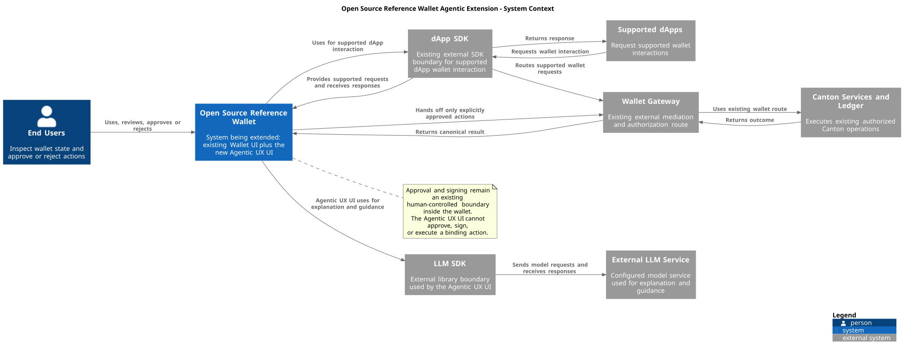
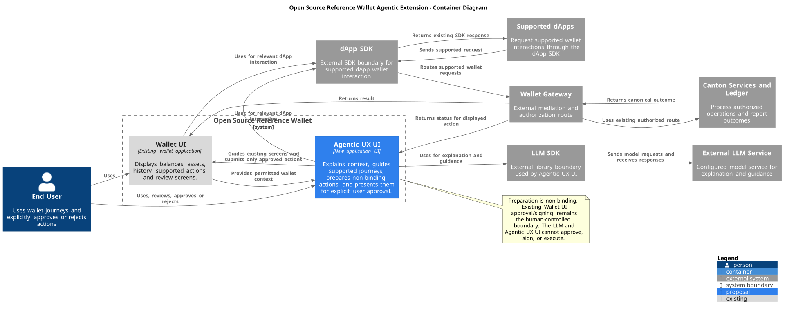

# Development Fund Proposal: Open Source Reference Wallet Agentic Extension

| Field | Value |
| :---- | :---- |
| Author | Unlockit |
| Org | Unlockit |
| Status | Draft |
| Created | 2026-08-18 |
| Champion | TBD |
| Primary repository | [Current wallet repository](https://github.com/canton-network/wallet) (implementation context) |
| Related proposal | [Approved Open Source Reference Wallet proposal](https://github.com/canton-foundation/canton-dev-fund/blob/main/proposals/2026-03-DA-proposal-open-source-reference-wallet.md) |
| Proposal name | Open Source Reference Wallet Agentic Extension |

---

## Abstract

This proposal requests Development Fund support for **Open Source Reference Wallet Agentic Extension**, an open-source extension to the Open Source Reference Wallet described in the [approved Open Source Reference Wallet proposal](https://github.com/canton-foundation/canton-dev-fund/blob/main/proposals/2026-03-DA-proposal-open-source-reference-wallet.md). The work adds an agentic user experience that helps a user understand the wallet, discover supported actions, and complete journeys without changing the wallet's existing authority model.

The agent will explain what the user can do, surface relevant portfolio and workflow context, guide the user through supported journeys, and prepare actions for review. A prepared action is non-binding. The user must explicitly approve it through the existing wallet approval and signing boundary before any binding execution occurs. The implementation will use the Open Source Reference Wallet's existing application structure, dApp SDK, Wallet Gateway, APIs, and test conventions as documented by the approved reference-wallet proposal and its implementation repository, rather than creating a parallel wallet or signing path.

The proposal does not fund autonomous signing, bypassing the Wallet Gateway, custody or ledger primitives, settlement primitives, SV governance reimplementation, or deprecated Validator Wallet work. It is a reference implementation and reusable UX pattern for wallet providers, dApp developers, and Canton ecosystem teams.

---

## Specification

### 1. Objective

Deliver an open-source, provider-agnostic agentic UX extension for the Open Source Reference Wallet described in the [approved Open Source Reference Wallet proposal](https://github.com/canton-foundation/canton-dev-fund/blob/main/proposals/2026-03-DA-proposal-open-source-reference-wallet.md). The [current wallet repository](https://github.com/canton-network/wallet) is implementation context, not the subject or owner of this proposal, with clear, testable boundaries between explanation, preparation, approval, signing, and execution.

The first release should enable a user to:

- understand portfolio state and the supported actions available in the current context
- ask questions about wallet concepts, balances, assets, transaction history, and action requirements
- receive guided, step-by-step assistance through supported Open Source Reference Wallet journeys
- prepare a supported action, including the inputs and expected consequences, for user review
- inspect a reviewable action summary before it is submitted to the existing approval/signing flow
- approve or reject the prepared action explicitly through the wallet's existing human-controlled boundary
- recover safely from missing information, stale state, denied approval, unsupported requests, or Wallet Gateway errors

The first release must not:

- sign autonomously or hold, derive, export, or manage user keys
- submit or execute a binding action without explicit human approval
- call ledger or signing endpoints by bypassing the Wallet Gateway or established dApp SDK route
- introduce custody, ledger, settlement, token, or authorization primitives
- reimplement SV governance
- revive, extend, or depend on deprecated Validator Wallet work
- claim support for a workflow, endpoint, or package interface until it is demonstrated against the current repository and tests

The intended outcome is a cloneable reference implementation that shows wallet providers and dApp developers how an agent can improve discoverability and task completion while preserving Canton authorization, Wallet Gateway, and signing boundaries.

### 2. Implementation Mechanics

The project will add an agentic interaction layer to the Open Source Reference Wallet described in the approved reference-wallet proposal. It will reuse the current wallet repository's application structure, dApp SDK integration, Wallet Gateway boundary, existing approval/signing components, and test harness as implementation context. Exact package names and interfaces will be confirmed against the repository at implementation start and recorded with the delivered code.

The implementation is organized around four responsibilities:

- **Context and explanation:** expose only the wallet and workflow context the user is permitted to see, and explain available actions and required inputs.
- **Journey guidance:** help the user navigate existing Open Source Reference Wallet screens and supported dApp journeys without inventing authority or changing contract semantics.
- **Action preparation:** construct a non-binding, reviewable representation of an existing supported wallet action.
- **Approval and execution handoff:** pass the prepared action to the existing Wallet Gateway and approval/signing route, requiring explicit human approval before binding execution.

The agent is an interaction and presentation layer. Existing wallet contracts, party authority, dApp SDK contracts, Wallet Gateway behavior, approval policy, signing mechanism, and ledger outcomes remain authoritative.

#### Open Source Reference Wallet

The reference implementation will use the current wallet and dApp SDK contracts as the source of truth. A small client-side domain adapter may normalize permitted read context and prepared-action metadata for the agent, but it will not create a competing contract model or signing API.

The adapter will:

- identify the current Open Source Reference Wallet context and supported action types
- preserve identifiers, amounts, parties, assets, recipients, and other fields supplied by the existing wallet route
- label data as current, unavailable, stale, or requiring user confirmation
- produce a deterministic review model for an action already supported by the wallet
- reject unsupported or ambiguous requests instead of fabricating an action

The adapter will not authorize, sign, submit, settle, or mutate Canton state.

The agent may explain an existing approval requirement shown by the Open Source Reference Wallet or Wallet Gateway and may guide a user to the applicable approval step, but it will not implement governance, vote, change governance state, or replace governance-owned interfaces.

Any approval prompt must make the distinction between:

- an agent-generated explanation or draft
- a wallet action prepared for review
- the user's explicit approval
- the canonical Wallet Gateway and signing/execution result

Recurring transfers, schedules, subscriptions, and other future financial obligations are out of scope unless the current wallet already exposes a supported journey and the implementation merely explains or guides that journey without adding new semantics. The project will not introduce scheduling, accrual, payment-stream, or settlement primitives.

This proposal delivers an agentic UX extension to the **Open Source Reference Wallet described in the approved Open Source Reference Wallet proposal**. The current [wallet repository](https://github.com/canton-network/wallet) is cited only as implementation context for that approved reference-wallet work.

The implementation will be grounded in repository evidence, including as applicable:

- `examples/portfolio/` for the existing Open Source Reference Wallet and its user journeys
- the repository's dApp SDK packages and examples for supported wallet-to-dApp interaction
- Wallet Gateway clients, routes, and configuration used by the Open Source Reference Wallet
- existing approval and signing components, which remain the only route to binding execution
- unit, component, integration, and end-to-end tests already covering these surfaces

The exact file-level inventory will be included in the release documentation and milestone evidence. It will distinguish existing code from new code and will not describe unverified implementation status as complete.

The agent may use a configured model or deterministic local interaction logic, but model selection is an implementation decision subject to privacy, reproducibility, and operational review. The baseline behavior must remain understandable and testable without granting the model authority. Sensitive context must be minimized and must follow the wallet's existing visibility and user-consent boundaries.

#### Illustrative Execution Flows

**Open Source Reference Wallet discovery and explanation**

1. The user opens the existing Open Source Reference Wallet and asks what is available.
2. The agent reads permitted current Open Source Reference Wallet context through existing application state and supported SDK/API reads.
3. The agent explains available assets, relevant status, and supported next actions, distinguishing observed facts from guidance.
4. The user selects a supported journey or continues through the existing UI.

**Prepare an action for review**

1. The user asks for help with a supported action exposed by the Open Source Reference Wallet.
2. The agent asks for missing inputs and validates them against the existing UI and SDK constraints.
3. The agent prepares a non-binding action representation using the existing action route.
4. The UI presents the recipient, asset, amount, party/account context, fees or other applicable fields, and a clear explanation of what will happen.
5. The user edits, rejects, or explicitly approves the prepared action.
6. Only after explicit approval does the existing Wallet Gateway and approval/signing route process the binding request.
7. The UI reports the resulting status from the canonical route, including rejection, cancellation, timeout, or failure.

**dApp-guided journey**

1. A supported dApp requests a wallet interaction through the existing dApp SDK boundary.
2. The agent explains the request in user terms and identifies the relevant Open Source Reference Wallet action.
3. The agent may prepare a reviewable response or transaction request using the SDK's existing shape.
4. The user reviews and explicitly approves or rejects it.
5. The Wallet Gateway and existing signing boundary remain responsible for authorization and execution.

The agent cannot turn a read-only request into a binding action, cannot approve its own preparation, and cannot retry a rejected binding action without a new explicit user decision.

### 3. Architectural Alignment

Open Source Reference Wallet Agentic Extension is application-layer public infrastructure that extends the Open Source Reference Wallet described in the approved Open Source Reference Wallet proposal. It aligns with Canton by preserving multi-party authorization, privacy-aware visibility, explicit party authority, dApp SDK boundaries, Wallet Gateway mediation, and canonical approval/signing behavior.

The architecture separates:

- Open Source Reference Wallet reads and permitted context
- agent explanation and guidance
- non-binding action preparation
- explicit user approval
- Wallet Gateway authorization and signing
- ledger and settlement outcomes already provided by existing Canton infrastructure

The agent does not create authority. It can only present actions already available through the current wallet integration and hand an approved action to the existing canonical route. Compatibility claims will be made only for interfaces demonstrated by repository tests.

#### Architectural Views

The architectural views are maintained as PlantUML sources under [`proposals/assets/`](assets/) and describe the implemented Open Source Reference Wallet integration without implying new wallet infrastructure:

-  ([PlantUML source](assets/open-source-reference-wallet-agentic-system-context.puml))
-  ([PlantUML source](assets/open-source-reference-wallet-agentic-container.puml))

##### System Context

The system context treats the Open Source Reference Wallet as the system being extended. It shows the existing Wallet UI and new Agentic UX UI as parts of that system, while dApp SDK and Wallet Gateway remain external dependencies. The context also shows the external LLM SDK and External LLM Service, Supported dApps, Canton services and ledger, and the end user. The Agentic UX UI receives permitted wallet context, uses the LLM SDK only for explanation and guidance, and sends only explicitly approved actions through the existing Wallet Gateway route. Approval and signing remain an existing human-controlled boundary inside the wallet; neither the LLM nor the Agentic UX UI can approve, sign, or execute.

###### System Context Box Catalog

| Box | Role | Relationship to the proposal | Status or authority boundary |
| --- | --- | --- | --- |
| End Users | Inspect wallet state and approve or reject actions | Use the Open Source Reference Wallet and agentic UX | Sole source of explicit human approval |
| Open Source Reference Wallet | Open Source Reference Wallet described in the approved reference-wallet proposal, containing the Wallet UI and Agentic UX UI | Hosts the existing journeys and the agentic UX | Approval and signing remain a human-controlled boundary inside the Wallet UI |
| dApp SDK | External SDK boundary for supported dApp wallet interaction | Supplies and receives supported dApp requests for the Wallet UI and Agentic UX UI | Existing SDK contracts and tests remain authoritative |
| Wallet Gateway | External wallet mediation and authorization route | Receives supported requests through the established dApp SDK and wallet route | Must not be bypassed or replaced |
| LLM SDK | External library boundary for model interaction | Connects the Agentic UX UI to the External LLM Service | Provides no wallet authority |
| External LLM Service | Configured external model service | Provides responses for explanation and guidance through the LLM SDK | Cannot approve, sign, or execute |
| Canton services and ledger | Execute existing authorized Canton operations | Receive effects through the Wallet Gateway | No new primitive is introduced |
| Supported dApps | Request supported wallet interactions | Integrate through the external dApp SDK | Adoption and compatibility require demonstrated interfaces |

##### Container Diagram

The container view is scoped inside the Open Source Reference Wallet system and contains exactly two containers: the existing **Wallet UI**, shown in gray, and the new/touched **Agentic UX UI**, shown in blue. Agentic explanation, guidance, action preparation, and presentation are encapsulated in Agentic UX UI rather than split into additional containers. The dApp SDK, Wallet Gateway, LLM SDK, External LLM Service, Supported dApps, and Canton services are external systems or libraries shown outside the system boundary. Approval and signing remain an existing human-controlled boundary within the Wallet UI; the LLM and Agentic UX UI cannot approve, sign, or execute.

###### Container Responsibility Catalog

The catalog uses the same box names as the [Container Diagram](assets/open-source-reference-wallet-agentic-container.puml).

| Box | Responsibility | Dependencies or outputs | Explicit boundary |
| --- | --- | --- | --- |
| End User | Uses wallet journeys and explicitly approves or rejects prepared actions | Wallet UI and Agentic UX UI | Sole source of explicit approval |
| Wallet UI | Displays balances, assets, history, supported actions, and review screens | Existing wallet repository and APIs; dApp SDK; Wallet Gateway | Existing surface; approval and signing remain human-controlled |
| Agentic UX UI | Explains context, guides supported journeys, and prepares non-binding actions | Wallet UI; dApp SDK; LLM SDK | Cannot approve, sign, submit, or execute |
| dApp SDK | Provides the external SDK boundary for supported dApp wallet interaction | Wallet UI, Agentic UX UI, Wallet Gateway, Supported dApps | Existing SDK contracts remain authoritative |
| Wallet Gateway | Mediates and authorizes supported wallet requests | dApp SDK, Wallet UI, Canton services and ledger | Must not be bypassed or replaced |
| LLM SDK | External library boundary used for model requests | Agentic UX UI and External LLM Service | Provides no wallet authority |
| External LLM Service | Provides configured model responses for explanation and guidance | LLM SDK | Cannot approve, sign, or execute |
| Canton Services and Ledger | Process authorized operations and report outcomes | Wallet Gateway | No new ledger or settlement primitive |
| Supported dApps | Request supported wallet interactions through the dApp SDK | dApp SDK | No direct agent or signing route |

### 4. Backward Compatibility

No protocol-level backward compatibility impact is expected. The proposal is an additive application-layer capability for the existing Open Source Reference Wallet and does not change Canton protocol behavior, ledger models, custody, settlement, governance, or signing primitives.

Existing Open Source Reference Wallet journeys must remain usable without the agent. Existing dApp SDK and Wallet Gateway integrations remain the compatibility boundary. The agent will be feature-gated where appropriate, will fail closed for unsupported requests, and will document any UI or configuration changes. Any unavoidable interface change will include migration and rollback guidance and will be validated against the current repository tests.

---

## Milestones and Deliverables

The milestones mirror the approved Open Source Reference Wallet proposal's four delivery stages. This proposal follows that wallet work closely behind: each agentic milestone depends on the corresponding wallet surface being available and tested, and the agentic work does not lead, replace, or claim coordination with that work. Dates are relative to the approved wallet milestone deliveries and must be replanned if those deliveries or their interfaces move.

### Milestone 1: Agentic Extension for Splice Portfolio dApp UI

- **Estimated Delivery:** After the approved wallet proposal's Milestone 1 acceptance, targeted within one month of the corresponding wallet surface becoming available
- **Focus:** Add bounded explanation, guidance, and non-binding action preparation to the Splice Portfolio dApp UI surfaces delivered by the approved wallet work.
- **Dependencies and fallback:** Requires the delivered Portfolio UI, its documented APIs, CIP-0056 support, CIP-0103 integration, Wallet Gateway test surface, and stable reviewable action schemas. If a dependency is late or differs from repository evidence, the agentic scope is limited to the available read and review surfaces, or the milestone is replanned. No upstream approval or coordination is assumed.
- **Deliverables / Value Metrics and Acceptance Criteria:**
  - repository evidence inventory mapped to the approved wallet Milestone 1 deliverables
  - context adapter and guidance flow for permitted portfolio state and supported actions
  - reviewable, non-binding preparation for at least one wallet action already exposed by the Portfolio UI
  - tests for context filtering, unsupported requests, stale state, and the explicit approval boundary
  - public documentation distinguishing reused wallet work from new agentic code

### Milestone 2: Agentic Extension Following Splice Portfolio Replacement

- **Estimated Delivery:** After the approved wallet proposal's Milestone 2 acceptance, targeted within one month of the replacement becoming available
- **Focus:** Extend the agentic UX to the supported default wallet journeys after Splice Portfolio and Wallet Gateway replace the existing default wallet surface.
- **Dependencies and fallback:** Requires the replacement wallet stack and feature-parity behavior described by the approved wallet Milestone 2. If replacement timing, feature parity, or interfaces change, deliver the agent against the latest documented supported Portfolio surface or defer affected flows through explicit replanning.
- **Deliverables / Value Metrics and Acceptance Criteria:**
  - guided explanations for supported Portfolio journeys, including any delivered pre-approval and transaction-history surfaces
  - action preparation and review for supported actions present in the replacement wallet
  - explicit approval, rejection, cancellation, and Wallet Gateway error paths
  - integration or sandbox evidence using the wallet work's available test setup
  - no claim that the agentic extension replaces or owns the underlying wallet replacement

### Milestone 3: Agentic Extension for Splice Wallet Browser Extension

- **Estimated Delivery:** After the approved wallet proposal's Milestone 3 acceptance, targeted within one month of the browser extension becoming available
- **Focus:** Bring the bounded agentic interaction patterns to the browser extension and its connection to the Portfolio dApp UI.
- **Dependencies and fallback:** Requires the delivered browser extension, party-management flows, in-browser key-storage boundary, browser compatibility evidence, and the Portfolio connection described by the approved wallet Milestone 3. The agent does not access or manage keys. If those interfaces are unavailable, scope falls back to explanation and review guidance at the Portfolio boundary until the extension surface is testable.
- **Deliverables / Value Metrics and Acceptance Criteria:**
  - agent context and guidance for supported browser-extension and Portfolio journeys
  - non-binding preparation handed to the existing user-controlled approval and signing boundary
  - end-to-end evidence that agent output cannot approve, sign, submit, or execute a binding request
  - documentation of integration assumptions and any required maintainer-reviewed contribution, without claiming approval

### Milestone 4: Agentic Extension for Future Known Wallet Improvements and Release

- **Estimated Delivery:** After the approved wallet proposal's Milestone 4 acceptance, targeted within one month of each supported improvement becoming available
- **Focus:** Document and, where interfaces are stable and tested, extend the agentic reference flows to future known wallet improvements.
- **Dependencies and fallback:** Depends on the approved wallet work delivering and documenting the relevant traffic-fee payment, WalletConnect, Token Standard v2, or multi-hosting-party surfaces. Unsupported or moving features remain documented integration points rather than promised implementations; affected work is deferred or replanned.
- **Deliverables / Value Metrics and Acceptance Criteria:**
  - release-ready open-source agentic reference implementation with setup, source paths, tests, limitations, and security/privacy evidence
  - supported future-improvement flows only where demonstrated against the delivered wallet interfaces
  - compatibility record identifying wallet versions, dependencies, and fallback behavior
  - release notes separating delivered agentic code, reused wallet code, assumptions, and unresolved upstream decisions

External adoption is an outcome of the aligned reference implementation, not a separately funded milestone in this proposal. Any adoption-linked funding or evidence requirement requires a later committee-approved revision.

---

## Acceptance Criteria

The Tech & Ops Committee will evaluate completion based on:

- deliverables completed as specified for each milestone
- a working agentic UX integrated with the existing Open Source Reference Wallet
- accurate explanation of supported actions and current permitted context
- reviewable non-binding preparation for supported Open Source Reference Wallet and dApp SDK journeys
- explicit human approval before any binding Wallet Gateway/signing request
- no autonomous signing, custody, ledger, settlement, SV governance, or deprecated Validator Wallet work
- documentation sufficient for another team to build, run, inspect, and extend the reference implementation

Project validation:

- **Working implementation.** The existing Open Source Reference Wallet runs with the agentic UX enabled and remains usable with it disabled.
- **Boundary preservation.** Tests demonstrate that agent output alone cannot approve, sign, submit, or execute a binding operation and that approved operations still use the existing Wallet Gateway and signing route.
- **Supported journeys.** Open Source Reference Wallet and dApp SDK flows are demonstrated only for action types present in the current wallet repository.
- **Passing test suite.** Relevant repository unit, component, integration, sandbox, and end-to-end tests pass, including new tests for approval, rejection, stale state, errors, and unsupported requests.
- **Open-source release.** Source, setup instructions, test commands, and limitations are public and reproducible.
- **Security and privacy.** Context access, prompt handling, data minimization, and fail-closed behavior are documented and reviewed.
- **External reuse.** Any later adoption or reuse claim requires documented evidence; it is not an acceptance gate for these four implementation milestones.

---

## Funding

**Base Funding Request:** Open decision; amounts must be recalculated against the narrowed scope before approval.

**Adoption-Linked Additional Funding:** Not requested in this draft; any future request requires a committee-approved revision.

**Total Funding Limit:** Open decision for the four aligned implementation milestones.

The funding request is intentionally left open because this proposal narrows the scope to an agentic Open Source Reference Wallet and its existing integration boundaries, while excluding governance, recurrence, custody, ledger, settlement, and deprecated Validator Wallet work. The committee should approve a recalculated budget against the milestones above before submission or acceptance. Any amount shown in a later revision must identify engineering, security/privacy review, documentation, and external adoption components separately.

### Payment Breakdown by Milestone

- Milestone 1 _(Agentic Extension for Splice Portfolio dApp UI)_: Open funding decision
- Milestone 2 _(Agentic Extension Following Splice Portfolio Replacement)_: Open funding decision
- Milestone 3 _(Agentic Extension for Splice Wallet Browser Extension)_: Open funding decision
- Milestone 4 _(Agentic Extension for Future Known Wallet Improvements and Release)_: Open funding decision

### Timeline Accountability

Any delay treatment, acceptance evidence, and return of unearned funds should be agreed with the Foundation and Tech & Ops Committee when the dates and amounts are set. Committee-requested scope changes, Wallet Gateway or dApp SDK dependency changes, and upstream maintainer decisions should be handled through explicit milestone replanning rather than treated automatically as proposer delay.

### Volatility Stipulation

The proposal is denominated in CC only after the funding decision is approved. If delivery or adoption extends beyond the core implementation period, any treatment of material CC volatility must be prospective, transparent, approved through the applicable process, and must not create an automatic top-up or alter an earned milestone.

### Open Funding Decisions

- total funding and per-milestone CC amounts
- exact calendar dates
- acceptable security/privacy review evidence
- whether any future adoption-linked funding is appropriate
- maintenance expectations after release
- whether any companion repository is preferable to changes in the wallet repository

### Funding Locking

No funding-locking commitment is proposed in this draft. Any retention or post-grant funding condition is an open committee decision and must not be inferred from this proposal.

### Cross-Proposal Adoption Stacking

No cross-proposal adoption rule is proposed in this draft. The agentic work follows the approved wallet proposal and must not claim the wallet proposal's deliverables, funding, adoption evidence, or maintainer approvals as its own.

---

## Co-Marketing

Subject to Foundation agreement, Unlockit will support:

- a coordinated announcement describing the agentic reference UX and its explicit human approval boundary
- an architecture article showing Open Source Reference Wallet, dApp SDK, Wallet Gateway, preparation, approval, and signing responsibilities
- a recorded technical walkthrough of discovery, guided action preparation, review, approval, rejection, and recovery
- a clone-and-run developer tutorial using `examples/portfolio/`
- publication of test evidence, limitations, and integration guidance for wallet providers and dApp developers

Commercial product marketing and customer-specific integrations remain outside grant scope.

---

## Motivation

The current Canton wallet repository already provides an open-source Open Source Reference Wallet, dApp SDK integration, Wallet Gateway, and approval/signing boundaries. Those building blocks are valuable, but users and dApp developers still need to understand which action is available, what information it requires, and what will happen before they reach the approval step.

An agentic UX can reduce this friction without changing the security model. It can make existing capabilities discoverable, guide users through supported journeys, and turn a natural-language request into a transparent draft for review. The reference implementation gives the ecosystem a concrete example of how to add this experience while keeping authorization and signing explicit and inspectable.

The common-good value is the boundary discipline: the agent is useful before approval and powerless to bind an action without the user and the existing wallet route.

---

## Rationale

**Why extend the existing Open Source Reference Wallet.** The Open Source Reference Wallet, dApp SDK, Wallet Gateway, approval routes, and tests are already the relevant integration surfaces. Extending them avoids a parallel wallet and makes the result directly useful to teams studying the current reference implementation.

**Why preparation rather than autonomy.** Users need assistance with complexity, but Canton actions remain authorization-sensitive. A reviewable draft provides convenience while preserving explicit human responsibility for binding execution.

**Why this is shared infrastructure.** Wallet providers and dApp teams can reuse the interaction patterns, action catalog, context boundaries, review components, and tests rather than independently designing an agent that may accidentally bypass the canonical wallet path.

**Why exclude new primitives.** Custody, ledger, settlement, token, governance, and signing primitives have independent ownership and security implications. They are not required to demonstrate the proposed UX and would make the proposal's public-good boundary less clear.

**Why adoption evidence.** Independent teams using or adapting the reference flows is stronger evidence of ecosystem value than model demos or stated interest. The exact adoption target and funding remain open until the implementation budget is recalculated.

---

## Maintenance

Unlockit will maintain the proposal's contributed reference implementation during the agreed grant period and will document ownership, issue handling, security disclosure, and release practices. Post-grant duration, staffing, response expectations, and funding remain open decisions. Maintenance will not imply a commitment to operate hosted agent services or to maintain customer-specific integrations.

---

## Governance and Open Decisions

The proposal champion remains **TBD**. Material scope, milestone, funding, licensing, model, privacy, or integration changes must follow the applicable Development Fund governance process. Technical decisions and interface evidence will be recorded publicly. Any upstream wallet repository contribution remains subject to its normal maintainer review.

Open decisions before submission:

- champion and responsible maintainers
- final repository location and contribution plan
- model/provider policy, if an LLM is used, and supported local/deterministic fallback
- security and privacy review scope
- total funding, CC amounts, percentages, dates, and adoption terms
- post-grant maintenance expectations
- exact current wallet paths and test commands to be cited in the final release record

---

## Related Projects and Standards

- [Current wallet repository](https://github.com/canton-network/wallet), especially `examples/portfolio/`, the dApp SDK, Wallet Gateway integration, approval/signing boundaries, and repository tests. This is implementation context for the Open Source Reference Wallet described in the [approved Open Source Reference Wallet proposal](https://github.com/canton-foundation/canton-dev-fund/blob/main/proposals/2026-03-DA-proposal-open-source-reference-wallet.md), not the scope or ownership boundary of this proposal.
- [CIP-0056 Token Standard](https://github.com/canton-foundation/cips/blob/main/cip-0056/cip-0056.md). The agent may explain supported asset actions exposed by the current wallet, but does not implement a token or settlement primitive.
- [CIP-0103 dApp Standard](https://github.com/canton-foundation/cips/blob/main/cip-0103/cip-0103.md). dApp interactions remain on the existing dApp SDK boundary and require explicit human approval before binding execution.
- [Splice](https://github.com/canton-network/splice) and its Wallet Gateway-related work. The proposal composes with current interfaces only and does not reimplement SV governance or deprecated Validator Wallet work.
- Existing reference wallet and Wallet Gateway Development Fund proposals. This proposal should be reviewed for overlap and should claim only the incremental agentic UX and its tests.

Where adjacent work changes an interface, implementation will validate the version actually used and update the compatibility record rather than assuming support.

---

## Risks

- **Autonomy confusion:** Users may mistake generated guidance for authorization. The UI must label drafts, require explicit approval, and test that the agent cannot cross the signing boundary.
- **Prompt or context injection:** Untrusted wallet or dApp content may influence explanations. Context must be minimized, treated as data, and tested against injection and malformed inputs.
- **Stale state:** A prepared action may no longer reflect current Open Source Reference Wallet state. The review route must revalidate or reject stale drafts before approval.
- **Unsupported actions:** Natural-language requests may exceed the wallet's supported action catalog. The agent must explain the limitation and fail closed.
- **Privacy:** Open Source Reference Wallet and party context may be sensitive. The implementation must follow existing visibility and consent boundaries and document any external model processing.
- **Gateway dependency:** Wallet Gateway or dApp SDK changes may affect the integration. Compatibility claims require versioned tests and explicit dependency tracking.
- **Scope expansion:** Autonomous execution, custody, governance, settlement, and new wallet primitives could turn this into a different project. They remain explicitly out of scope.
- **Adoption evidence:** Independent adoption is outside the proposer’s control. The Foundation should agree acceptable equivalent evidence before adoption-linked funding is included.
- **Maintenance:** Model providers, security expectations, and wallet interfaces may change. The release must document supported versions, fallback behavior, and ownership.
- **Funding and volatility:** Funding amounts, dates, and adoption terms remain open and require recalculation before approval.
