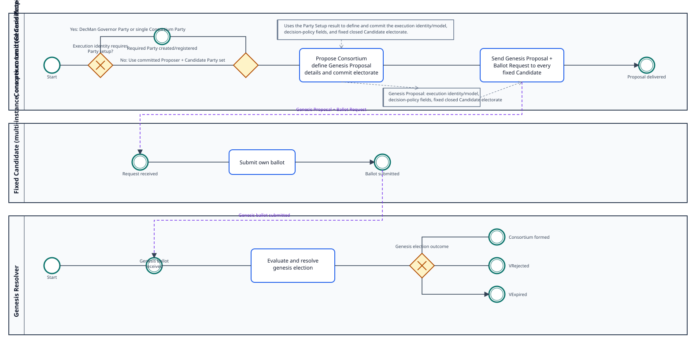
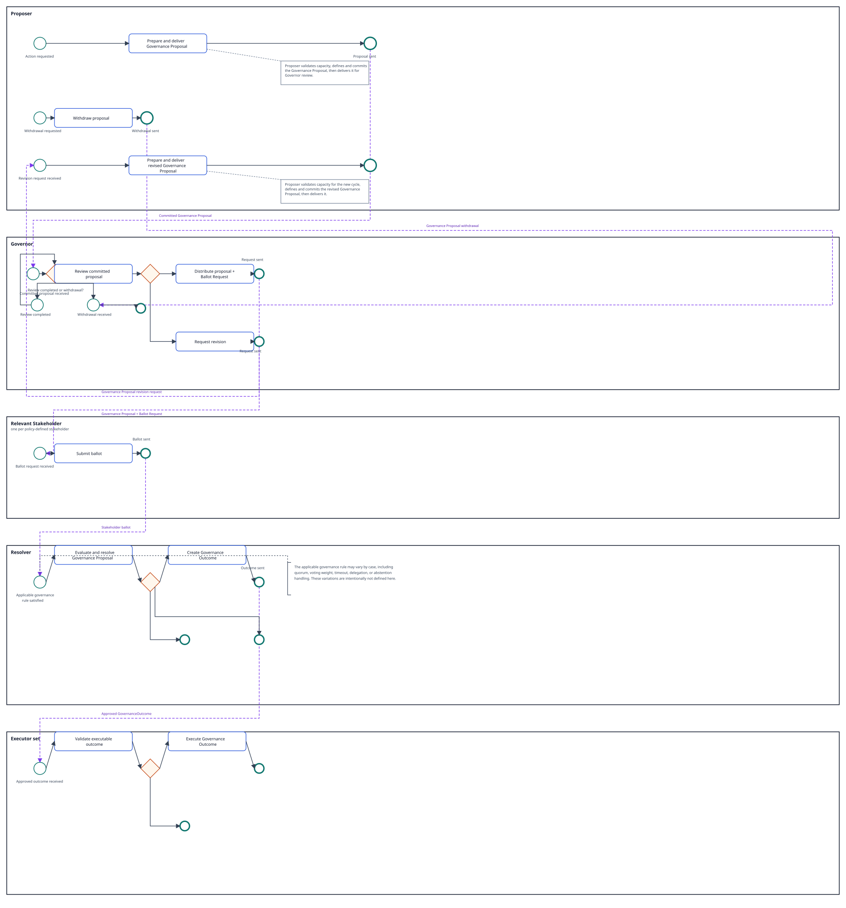
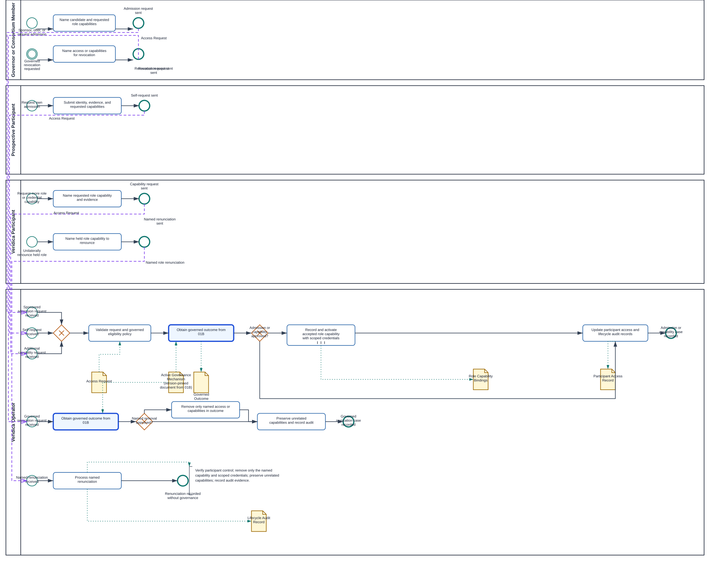
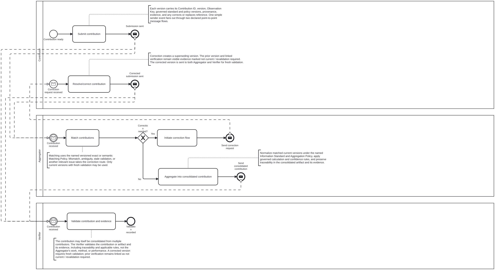
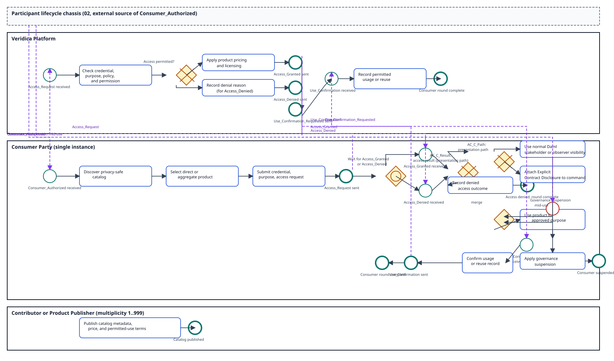
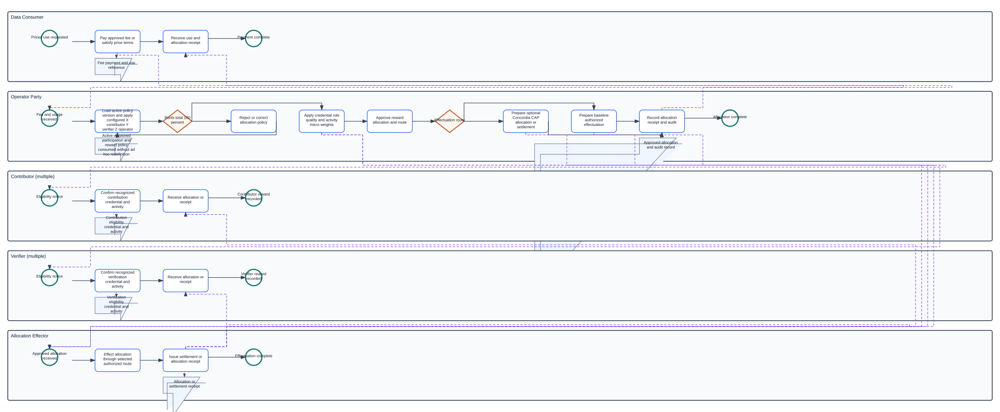

## Development Fund Proposal

**Author:** Unlockit (luis.marado@unlockit.io)
**Status:** Draft
**Created:** TBD
**Champion:** TBD

> This draft is provided for discussion. It does not create a funding, delivery, governance, adoption, endorsement, or Foundation commitment.

---

## Abstract

Veridica evolves conventional oracles from relying mainly on trusted third-party providers toward stronger, inspectable confidence in information. One or more contributors can provide information and evidence, and independent verifiers can check it when appropriate. Validation rules, supporting evidence, challenges, and past checks help applications assess confidence without treating a provider, a contract, or the ledger as a guarantee of truth.

Selective disclosure and controlled reuse are central to Veridica. It manages access and permitted use on a need-to-know basis through two complementary paths. Under normal Canton contract visibility, stakeholders see contract data, while participant or validator nodes host parties and retain and synchronize contract data according to those parties’ stakeholder visibility. When a non-stakeholder needs a contract for a specific workflow, a stakeholder can send an authenticated contract copy off-ledger for attachment to that workflow’s command. This permits workflow use without making the recipient a stakeholder, adding the contract to its normal visible contract set, or changing Daml authorization.

A traceable history shows how information was submitted, checked, corrected or replaced, shared, and used while retaining previous versions, evidence, checks, and reasons. Each application can choose acceptance thresholds based on its purpose and risk. Policies can control who may access, verify, use, or further share information and can allocate rewards to eligible contributors and verifiers based on the information and validation work the application recognizes.

---

## Specification

### 1. Objective

Veridica’s objective is to provide shared Canton application primitives for information that can be contributed, checked, used on a need-to-know basis, and rewarded. It aims to move oracle use beyond relying mainly on a provider’s reputation toward confidence that applications can assess from evidence, validation, independent checks, and history.

Veridica must enable applications to:

- accept information and supporting evidence from one or more contributors
- apply clear validation rules and, when appropriate, record checks by independent verifiers
- preserve evidence, challenges, corrections, previous versions, and the reasons for changes
- control selective disclosure and permitted use through normal Canton stakeholder visibility or Daml Explicit Contract Disclosure, without weakening Daml authorization
- set acceptance rules and confidence thresholds suited to each application’s purpose and risk
- trace how accepted information and verification work lead to policy-approved reward allocations for eligible contributors and verifiers
- reuse common, provider-neutral primitives across different applications instead of depending on one provider-specific product

Success means an independent Canton team can use the shared primitives to build a workflow in which information is contributed, assessed, selectively used, updated with its history intact, and connected to an authorized reward decision. Veridica does not guarantee truth or data quality, make rewards automatic, or replace the governance and authorization rules chosen by each application.

### 2. Implementation Mechanics

Veridica will provide reusable Daml contracts, interfaces, application components, and reference flows. Its model will use composable contracts and linked records with separate responsibilities rather than one contract that represents the whole system. The exact contract, package, and interface decomposition will be validated during implementation.

#### Governed identifiers, standards, and policies

Each sharing context will use named and versioned configuration maintained by an operator, consortium, governed service, or another authorized authority. The configuration may include:

- an **Identifier Scheme** defining how subjects and submissions are identified
- an **Information Standard** defining fields, units, formats, and required metadata
- an **Observation Key Policy** defining which fields identify the same contextual observation
- a **Matching Policy** defining exact and semantic comparison, eligible matchers, tolerances, and review routes
- an **Aggregation Policy** defining contribution selection, normalization, calculation, publication, pricing, and reward rules

An **Observation Key** identifies a contextual observation that related contributions may describe. A **Contribution ID** uniquely identifies each submission. Contributions with the same Observation Key remain separate records with separate contributors, evidence, checks, permissions, and histories.

Observation Keys are domain-specific. The following compact examples are illustrative, not universal requirements:

| Example | Illustrative Observation Key fields |
|---|---|
| Equity price | Instrument ticker or stronger governed identifier + market + metric + currency + observation date + adjustment basis |
| Real-estate valuation | Jurisdiction + property identifier + metric + effective date + currency + valuation basis |

A policy may require stronger identifiers, finer timestamps, source categories, or other context. Changes to a scheme, standard, or policy create a new version so applications can identify exactly which rules were used.

#### Composable information, evidence, and decision records

An information or assertion contract will contain submitted information or a reference to a document or dataset held elsewhere. It will carry its Contribution ID, identify one or more sources or contributors, declare the governed Information Standard and version, state its Observation Key under the applicable policy, and reference the configuration governing its sharing context.

A contribution may contain one record or a batch. Every contribution declares its standard and version, and every record remains independently identifiable, matchable, validatable, and traceable. A submission using multiple standards must place records in explicit standard groups or use separate batches. A batch is only a submission container; it is distinct from an aggregate information product calculated from selected inputs.

Separate provenance and evidence records will link a contribution to sources, supporting documents, transformations, and earlier versions. Validation and verification records will identify the contribution and record checked, method used, evidence considered, result, limitations, responsible party, and declared conflicts. Lifecycle or decision records may separately record whether a version is pending, accepted, rejected, disputed, expired, corrected, or replaced. Usage, reuse, reward-eligibility, and allocation records will remain separate and linked.

Information may also relate explicitly to an earlier contribution through `supports`, `contradicts`, `corrects`, `replaces`, `enriches`, `derives_from`, or `duplicates`. These relations are claims, not proof. They remain subject to matching, validation, verification, and challenge, and they preserve the history of both records.

The ledger will hold contracts and state needed by the workflow. Larger documents or sensitive evidence may remain off-ledger and be delivered through an authorized channel. A ledger reference records their relationship to a contribution but does not by itself prove that the referenced material is correct, available, or unchanged.

#### Discovery, matching, validation, and confidence

A privacy-safe discovery or catalog record may signal that information exists for a governed subject and type without exposing protected values, evidence, unnecessary contributor identity, or contributor counts. Policies may also support optional invitations for eligible contributors and verifiers.

A matching engine or authorized matcher first applies a named and versioned Matching Policy. **Exact matching** compares governed Observation Key fields directly. **Semantic matching** applies stated normalization, mappings, tolerances, or contextual rules. Outcomes are matched, ambiguous and sent for manual review, or not matched. Matching only decides whether records may be compared; it does not prove truth, quality, agreement, or independence.

Only matched and comparable records proceed to comparison. A comparison may conclude that records corroborate, contradict, remain incomparable, or provide insufficient evidence. Independent submissions against the same Observation Key and explicit relations to prior contributions are both supported. An extra or duplicate contribution does not validate another record merely because it exists.

Applications select validation rules and eligible independent verifiers through their policy. Where independence is required, a contributor cannot verify its own contribution. Conflict and role rules apply to matchers, verifiers, aggregators, and adjudicators. Verifiers may attest, request evidence, or raise a challenge. Corrections and replacements retain prior versions, checks, evidence, challenges, and reasons.

Confidence is policy-based, not a raw vote or contribution count. It may consider evidence quality, method, operator and verifier independence, recency, unresolved disputes, corroboration, contradiction, and possible duplicate, Sybil, or collusive behavior. Each application chooses the policies, operators, verifiers, confidence measures, and acceptance thresholds it recognizes for its purpose and risk.

#### Aggregation and information products

An aggregation pipeline creates a distinct information product from eligible source records. It will identify authorized inputs, normalize them under a named and versioned Information Standard and Aggregation Policy, handle outliers and missing data, apply recency rules, require any minimum number of independent inputs, and record supporting confidence and evidence.

Publication controls define who may receive or use the aggregate product. Pricing and licensing rules apply independently to the aggregate and its source records. Reward rules may recognize eligible contribution, matching, verification, aggregation, or adjudication work. Every aggregate remains traceable to the input versions, policies, methods, decisions, and evidence used to create it.

An application may offer only aggregate products without selling or exposing source contributions, subject to the applicable permissions. This does not make aggregation a truth guarantee, and a minimum input count does not replace quality, independence, or conflict checks.

#### Need-to-know access and controlled reuse

Veridica will support two complementary Canton visibility paths across its contracts and records. Under normal Daml stakeholder or observer visibility, relevant parties see contract data and their participant nodes retain and synchronize the contract data those parties are entitled to see. For command-specific use by a non-stakeholder, a stakeholder may send an authenticated contract copy through an off-ledger channel using Daml Explicit Contract Disclosure. The recipient can attach that copy to a command, and the ledger validates it during transaction processing. This relaxes visibility for that command; it does not add the contract to the recipient's normal visible contract set or change Daml authorization.

Policies state who may receive information or evidence, for which purpose it may be used, whether it may be shared or reused, and when permission expires. Separate usage and reuse records link an authorized workflow to the source or aggregate product, policy, permission, and version used. Revocation cannot make a party forget information already received.

Where compatible interfaces become available, Veridica may interoperate with privacy and lineage primitives proposed by [CAPS in PR #497](https://github.com/canton-foundation/canton-dev-fund/pull/497). This is optional composition subject to interface review and tests, not a dependency on that proposal being approved.

#### Pricing, rewards, and distributed operation

Pricing and licensing may be configured at a macro level for a sharing context or at a micro level for a subject, information type, contribution, aggregate product, or permitted use. Accepted work may create separate reward-eligibility records identifying the recognized contribution, matching, verification, aggregation, or adjudication work, eligible parties, evidence, policy, and authorized allocation route. Eligibility does not create an automatic payment or entitlement.

Where validated interfaces fit, Veridica intends to reuse Concordia's Canton Allocation Primitives for optional governance of macro or micro pricing and policy decisions, and for reward allocation or settlement handoffs. Current CAP is not assumed to implement Veridica's complete evidence, pricing, or reward model. Asset representation and final settlement remain separate from Veridica's information and eligibility records.

The operating model is configurable and distributed. Multiple matchers, verifiers, aggregators, or adjudicators may issue assessments under different named policies. There is no globally canonical result by default. Applications choose recognized policies, operators, authorities, and thresholds. An operator, consortium, or another authorized governance body may maintain each configuration without forcing every application into one decentralization model.

#### Application integration and reference workflow

Versioned Daml interfaces, an SDK, reusable UI components, and reference adapters will let applications submit records or batches, follow provenance and evidence, discover available information safely, inspect matching and lifecycle decisions, apply acceptance policies, request permitted use, create aggregate products, and inspect pricing and reward state. These components prepare or submit actions only through authorized routes; they do not grant contract authority.

A reference workflow will demonstrate:

1. an authorized party publishes named and versioned identifier, information, observation-key, matching, and optional aggregation policies
2. optional invitations identify eligible contributors or verifiers
3. one or more contributors submit independent records or a relation to a prior contribution, each with a Contribution ID, Observation Key, standard version, provenance, and evidence
4. the catalog signals availability without revealing protected content or unnecessary contributor activity
5. an authorized matcher applies exact or semantic matching and routes ambiguous cases for review
6. validation, independent verification, challenges, and application policy produce a confidence assessment and lifecycle decision
7. an authorized application either uses an accepted record directly or creates and uses a traceable aggregate product
8. normal Daml visibility or Explicit Contract Disclosure supplies the contract input needed for the authorized workflow
9. pricing and licensing are applied, usage is recorded, and recognized work may produce eligibility for an authorized reward-allocation decision
10. corrections, replacements, challenges, and expiry feed back into later decisions while preserving history

At proposal level, controls include role and conflict policies, duplicate and replay handling, stale and archived-state handling for disclosed contracts, explicit expiry, separation of duties where required, and an audit trail linking material actions to actors, policies, evidence, and prior state.

#### Consortium authority, execution, and hosting models

Veridica separates four concerns that implementations must not collapse:

- **Governance authority** is the consortium body entitled to adopt governance policy and authorize bounded changes.
- **Governor** receives committed Governance Proposals and distributes each Governance Proposal + Ballot Request to every policy-defined relevant stakeholder. The Governor is a separate logical role, not the source of governance authority.
- **Resolver** performs `Governor Resolve` when accepted by `Resolution.isResolver`, evaluating all live Ballots under the active governance policy. Resolution atomically performs `admit → tally → Verdict`, issues a `GovernanceOutcome` only for `VApproved`, and then invokes `onResolved`. Resolver is a separate logical role.
- **Execution Model and execution identity** define which Daml party or parties may carry out an authorized outcome, under which versioned controls. The executor set is a separate logical role from Governor and Resolver. Governor and Resolver may be assigned to the same Party or configuration, but that assignment neither merges roles nor changes the governance workflow.
- **Participant hosting or custody** determines where those parties are hosted and how keys or operational control are held. Hosting or custody does not itself grant governance authority, Governor status, or business authorization.

Consortium formation is a one-time bootstrap process. The Consortium Lead acts as Genesis **Proposer** and commits the closed immutable Candidate electorate when proposing the Consortium. 01A intentionally scopes only to that formation trigger and the visible execution-identity prerequisite; it does not represent all current policy decisions.

Only `VApproved` finalization establishes the selected Genesis Governor or Resolver and versioned active Execution Model from the approved proposal and Initial Charter definitions. `VRejected` and `VExpired` establish neither. The selected model may be a distributed M-of-N operator-party arrangement, a single execution party controlled by a consortium legal entity, an optional DecMan-backed Canton Decentralized Party using supported open-source components, or a compatible future model. DecMan and Canton Decentralized Party are options, not requirements. DecMan supplies an execution mechanism, not the business policy engine; the approved proposal and charter definitions determine business authorization.

After genesis, reusable consortium governance follows CAP terminology and mechanics: a **Proposer** eligible under the active governance policy opens a Governor/decision carrying its `Action`, commitments, and submission/expiry window; eligible voters cast all live **Ballots** through `Ballot_Cast`; and a resolver accepted by `Resolution.isResolver` invokes atomic **Governor Resolve**. Resolution performs `admit → tally → Verdict`, issues a **GovernanceOutcome** only for `VApproved`, and invokes `onResolved`. `VRejected` and `VLapsed` end without a GovernanceOutcome and cannot reach **GovernanceOutcome Execute**. Operators are likely eligible under the initial policy but are not hard-coded as the only Proposers, and the Execution Model does not determine proposer eligibility. Policy, reward, membership, rules, execution-model, and other supported changes are Proposal `Action` types rather than separate setup workflows.

For a consortium action, proposal opening creates the Governor/decision and records `submissionOpensAt`, `submissionClosesAt`, and `expiresAt`. It carries the exact `Action (AA_Native | AA_Extension) — policy / rewards / membership / rules / execution-model` and records `Committed Targets` as `ForTarget (authorities + id) + optional stateToken` through `Action_buildRefs`. Before resolve, the proposer may use `Governor_Withdraw` only when `withdrawAllowed`; Ballot recast, when supported, is another `Ballot_Cast` before resolve. A revised proposal starts a new Governor and decision cycle rather than looping or resubmitting in the current cycle. `GovernanceOutcome Execute` takes the Committed Targets and active Execution Model as inputs, checks the execute window, `isExecutor(actors)`, and committed-target key match, then applies the declared drift policy and effect. The active Execution Model is read only at execution as the executor set and does not gate proposer eligibility or proposal opening. An execution-model proposal acts on `ExecutionModel` as a Committed Target; it does not produce the model as generic output. Rejected or lapsed decisions issue no outcome and never execute; an approved outcome may also expire unexecuted through `Outcome_Expire` when `executeUntil` applies. Execution records Mutated Targets and a Veridica audit receipt.

Reward governance is separate from governance voting weight. Macro rules may divide an approved reward amount into **X% for contributors, Y% for verifiers, and Z% for operators**, with any additional eligible roles explicitly defined. The policy must validate that all pools total 100%. Within each pool, micro allocation may use eligible credentials, role, recognized activity, quality, or other governed weights. Governance weights do not automatically become reward weights. Optional Concordia/CAP allocation or settlement interfaces may be used where validated interfaces fit; a non-CAP allocation path remains supported.

#### BPMN Workflow Index

The BPMN models use pools and lanes only for real actors. Contracts, policies, credentials, proposals, approvals, Governor mechanisms, and records appear as data used or produced by actor tasks. Sequence flows model lifecycle order within a process; message flows connect separate participant processes when the workflow uses multiple pools.

| Workflow | GitHub view | Canonical BPMN 2.0 source | Purpose |
|---|---|---|---|
| 01A. Consortium formation and genesis election | [SVG](assets/01a-veridica-consortium-formation.svg) | [BPMN](assets/01a-veridica-consortium-formation.bpmn) | Forms the Consortium through a genesis election: first complete any required Party setup, then propose the Consortium by defining the proposal details and committing the fixed Candidate electorate, deliver the proposal and ballot request, collect Candidate ballots, then resolve the outcome. |
| 01B. Consortium governance | [SVG](assets/01b-veridica-consortium-governance.svg) | [BPMN](assets/01b-veridica-consortium-governance.bpmn) | Runs reusable CAP governance from policy-derived proposer eligibility and live Ballots through atomic resolution; only approved outcomes may execute using the active Execution Model as the executor set. |
| 02. Veridica Access Lifecycle | [SVG](assets/02-veridica-access-lifecycle.svg) | [BPMN](assets/02-veridica-access-lifecycle.bpmn) | Routes sponsored and self-requested admission, additional role or credential requests, governed revocation, and unilateral named role renunciation through the Veridica Operator. Contributor, Aggregator, Verifier, and Consumer are independently accepted functional role capabilities, not participant pools; accepted bindings alone create scoped credentials. Governed cases call the reusable 01B mechanism through a collapsed activity. |
| 02a. Access Governance and Trust Weighting |  |  | Reserved for a future BPMN covering weighting formulas, thresholds, and reassessment. Workflow 02 consumes and records the governed eligibility outcome without reproducing those mechanics. |
| 03. Data producer actions | [SVG](assets/03-veridica-data-producer-actions.svg) | [BPMN](assets/03-veridica-data-producer-actions.bpmn) | Shows Contributor, Aggregator, and Verifier as separate participants. Every initial or superseding contribution version is explicitly delivered to both Aggregator and Verifier; correction requires fresh validation, and the Verifier later verifies the consolidated artifact and evidence rather than Aggregator performance or method. No flow reaches 05. |
| 04. Consumer actions | [SVG](assets/04-veridica-consumer-actions.svg) | [BPMN](assets/04-veridica-consumer-actions.bpmn) | Shows Consumer, Data Provider, and Escrow. The Consumer selects a direct single data point or aggregation and requests a binding time-bound quote. Acceptance instructs Escrow to lock the Consumer token; only Escrow notifies the Data Provider. The Data Provider prepares the selected data after escrow lock, requests settlement, and delivers only after settlement confirmation. Decline, cancellation, or quote expiry ends without transfer or data. |
| 05. Reward allocation | [SVG](assets/05-veridica-reward-allocation.svg) | [BPMN](assets/05-veridica-reward-allocation.bpmn) | Actors validate macro pools and micro weights before optional CAP or baseline effectuation and audited receipts. |

"Open" discovery or registration means that parties can find the process and apply. Formal roles, workflow actions, and information access remain subject to credentials, election or approval, policy, and Daml authorization.

#### 01A. Consortium Formation and Genesis Election

The **Consortium Lead** is the Genesis **Proposer**. The sequence is: Start; decide whether the execution identity requires Party setup; either create or register the required DecMan Governor Party or single Consortium Party, or use the committed Proposer + Candidate Party set; then **Propose Consortium**. The one substantive **Propose Consortium** task uses the Party Setup result to define and commit the selected execution identity/model, configured decision-policy fields, and fixed, closed Candidate electorate.

After proposing, the Proposer sends the Genesis Proposal and Ballot Request to every fixed Candidate. Each Candidate individually submits its ballot to the Genesis Resolver. The Genesis Resolver evaluates and resolves the genesis election, ending in **Consortium formed**, **VRejected**, or **VExpired**. Candidate membership, privacy, deadlines, rejection, and replacement remain configured in the proposal rather than being represented as branch machinery.

Canonical source: [01A Veridica consortium formation and genesis election BPMN 2.0](assets/01a-veridica-consortium-formation.bpmn).

#### 01B. Consortium Governance

Each reusable governance cycle derives Proposer eligibility from the **active governance policy**; operators are likely eligible initially, but eligibility remains configurable and is not read from the Execution Model. The Proposer validates capacity, defines Governance Proposal details carrying its Action, commitments, and submission/expiry window, commits it, and delivers the committed proposal to the Governor. The Governor receives the committed proposal as an intermediate message catch event, reviews it, then either distributes the Governance Proposal + Ballot Request to every policy-defined relevant stakeholder or ends that proposal and sends a revision request. A revision request starts a distinct Proposer message-start process that validates capacity, defines, commits, and delivers a **new** Governance Proposal cycle. It is not a sequence-flow loop or a reopened ballot.

Every cross-pool receipt is modeled as an intermediate message catch event. Each Relevant Stakeholder pool instance receives the Governance Proposal + Ballot Request and submits its own Ballot through `Ballot_Cast` to the Resolver. The Resolver receives stakeholder ballots, evaluates and atomically resolves the Governance Proposal: `admit → tally → Verdict; issue only VApproved; onResolved`. The `Verdict?` branch creates a GovernanceOutcome and notifies the Executor set only for `VApproved`; `VRejected` and `VLapsed` terminate with no outcome and no execution. While Governor review is pending, the Proposer may send `Governor_Withdraw`; its message interrupts that review and ends the proposal. GovernanceOutcome Execute is performed by the executor set. It receives the approved outcome, validates executable outcome using the active Execution Model and Committed Targets only at execution, then routes to execution or expiry. Execution checks the execute window, `isExecutor(actors)`, and committed-target key match before applying the declared drift policy and effect. It records Mutated Targets and a Veridica audit receipt.

Governor, Resolver, and Executor remain separate logical roles. They may be assigned to the same Party or configuration, but the BPMN does not merge, fix, default, or branch on that assignment. A Governor single Party/set and DecMan-managed/non-DecMan remain configuration choices, not BPMN branches.

Policies, rewards, membership, rules, execution-model updates, and compatible future changes are Proposal action types. They are not separate governance/reward setup phases. CAP supplies the governance vocabulary and proposal-resolution mechanics; DecMan or a Canton Decentralized Party may supply an execution option but is not the business policy engine.

Canonical source: [01B Veridica consortium governance BPMN 2.0](assets/01b-veridica-consortium-governance.bpmn).

The dependency is: **01A forms the Consortium through its genesis election → 01B governs reusable consortium decisions after formation**. 01A uses only the fixed genesis Candidate electorate; 01B does not replace or broaden that formation election.

#### 2. Veridica Access Lifecycle

Workflow 02 separates the Governor or Consortium Member, Prospective Participant, active Veridica Participant, and Veridica Operator. Every admission, capability, governed revocation, or unilateral renunciation request is delivered to the Operator. A Governor or Consortium Member may sponsor, offer, or request admission; a Prospective Participant may submit its own admission request; and an active Veridica Participant may request more role or credential capabilities or unilaterally renounce a specifically named held role capability.

Contributor, Aggregator, Verifier, and Consumer are functional role capabilities held by a Veridica Participant, not primary participant pools. For admission and additional capabilities, the Operator validates the request and eligibility policy, then uses the collapsed **Obtain governed outcome from 01B** call activity. That activity consumes the **Active Governance Mechanism**, a version-pinned document from 01B, while encapsulating the reusable ballot, resolution, and verification mechanics. Workflow 02 shows no external 01B actor, ballot, resolver, or direct platform participant.

An approved admission or capability outcome identifies the accepted role capabilities. For each accepted capability, the Operator directly records and activates the binding and its scoped credentials without requesting a second acceptance or decline. Governed revocation also calls 01B and removes only the named access or capabilities in the approved outcome. By contrast, unilateral self-renunciation verifies participant control and removes the named held capability and its scoped credentials without governance approval, preserving every unrelated capability. The Operator records the request, outcome, participant access state, role capability bindings, scoped credentials, and lifecycle audit trail.

The Aggregator and Verifier capabilities remain mutually exclusive for the same product as a governed eligibility policy. The downstream 05 reward-allocation workflow remains isolated: it consumes versioned participation and reward policy records and receives no direct message flow from Workflow 02.

##### 2.1 Data Producer Actions

Workflow 03 is a BPMN collaboration with separate Contributor, Aggregator, and Verifier pools. Participant lifecycle and technical Platform behavior remain outside this workflow. The Contributor submits a versioned contribution with its Contribution ID, Observation Key, governed standard and policy versions, provenance, evidence, and any relation to an earlier contribution. One simple sender event delivers the version through two declared point-to-point message flows, one to the Aggregator and one to the Verifier. Each participant has a matching message catch, so this handoff is not an ambiguous broadcast. The Verifier validates the received contribution and its evidence locally. Validation is terminal to the Verifier and does not gate, alter, or affect the Aggregator's matching or aggregation. The Aggregator evaluates correction needs within its own flow.

The Aggregator catches the contribution, matches contributions under the named versioned exact or semantic Matching Policy, then evaluates **Correction needed?** A mismatch, ambiguity, or other relevant issue causes the Aggregator to initiate a correction flow and send a correction request to the Contributor. The Contributor resolves or corrects the contribution and submits a superseding version. The prior version and its linked verification remain visible evidence marked **not current / revalidation required**. The superseding version follows the same simple sender path to both participants and receives fresh local validation at the Verifier.

When no correction is needed, the Aggregator normalizes matched current contribution versions under the named versioned Information Standard and Aggregation Policy, applies governed calculation and confidence rules, preserves traceability, and aggregates them into a consolidated contribution. The Aggregator sends that consolidated contribution and its evidence to the Verifier. The Verifier verifies the consolidated artifact, evidence, traceability, and applicable rules. This verification does not assess the Aggregator's work, performance, or method.

The Contributor and Verifier retain separate initial submission and validation lifecycle paths without introducing a Platform actor or participant-lifecycle start. A Contributor cannot verify its own contribution where independence is required. The same party cannot be both Aggregator and Verifier for the same product. Matching, aggregation, and verification do not guarantee truth, data quality, agreement, reward, or a governance outcome. No flow reaches workflow 05 reward allocation.

##### 2.2 Consumer Actions

Workflow 04 is a BPMN collaboration among **Consumer, Data Provider, and Escrow**. The Consumer selects either a direct single data point or an aggregation and sends a quote request to the Data Provider. The Data Provider receives the request, prepares a binding time-bound quote, and sends it to the Consumer.

The Consumer receives and reviews the quote. Decline or cancellation ends locally without transfer or data, and expiry at the quote timestamp also ends locally without transfer or data. If the Consumer accepts, the Consumer sends the accepted quote and token-lock instruction to Escrow. Acceptance is not sent directly to the Data Provider.

Escrow receives the instruction, locks the Consumer token, and sends **Escrow locked** only to the Data Provider. The Data Provider waits after sending the quote for one of three events: Escrow locked, quote declined or cancelled, or expiry at the quote timestamp. Only Escrow locked allows the Data Provider to prepare the selected data and send **Settlement request / data ready** to Escrow.

Escrow receives the settlement request, transfers the locked token or value to the Data Provider, and sends **Settlement confirmed** to the Data Provider. Only after receiving that confirmation does the Data Provider deliver the selected data to the Consumer. The Consumer receives the data and the workflow ends. Escrow does not receive or process decline or expiry, and the workflow defines no post-lock cancellation, refund, dispute, or failure outcome.

##### 2.5 Access Governance and Trust Weighting

Workflow 02 consumes and records the governed eligibility outcome used for admission, capability offers, and governed removal. It preserves Aggregator and Verifier mutual exclusion for the same product as a governed eligibility policy, but it does not define the detailed weighting formula.

The future Workflow 02a, **Access Governance and Trust Weighting**, will define the trust dimensions, quota or influence formula, capability-specific thresholds, and dynamic reassessment triggers. Until that workflow is designed, actor type, reputation, history, certifications, threshold values, and reassessment cadence remain versioned governance-policy concerns. Workflow 02 records the applicable outcome and policy evidence without duplicating 01B mechanics or pre-empting the 02a design.

#### 5. Reward Allocation

The downstream reward workflow is independent of the participant lifecycle above: it consumes the active versioned participation and reward policy that the 02 chassis and 03, 03a, 03b, 04 role-party actions record and does not redefine it ad hoc. It validates the configured macro pools and applies the approved credential, role, quality, independence, activity, usage, cap, and floor rules within each pool. Governance voting weights do not automatically equal participation, confidence, or reward weights. Approved allocations may use optional Concordia/CAP interfaces where they fit or a baseline authorized route, followed by receipts and audit records. No message flow from the 02 participant-lifecycle or 03, 03a, 03b, 04 role-party actions reaches 05; 05 reads only the versioned participation and reward policy it is authorized to consume.

### 3. Architectural Alignment

Veridica aligns with Canton strengths in privacy-aware multi-party workflows, explicit authorization, deterministic contract state, and auditable lifecycle transitions. It separates content from provenance, verification from governance, access from reuse permission, reward eligibility from settlement, and user-interface action discovery from authority.

The project is complementary to [CAPS PR #497](https://github.com/canton-foundation/canton-dev-fund/pull/497). CAPS proposes the Canton Access and Privacy Standard and a privacy-preserving push-oracle model for selectively visible signed records. Veridica can reuse validated CAPS access and privacy patterns while addressing a wider contribution lifecycle: multiple evidence sources, independent verification, confidence, challenge, transformations, controlled reuse, and rewards. This broader scope does not diminish CAPS's common-good value or prejudge its interfaces.

CAP means Canton Allocation Primitives and is separate from CAPS. CAP/Concordia is relevant to governed decisions, allocations, and reward routing. Veridica will claim compatibility with CAPS or CAP/Concordia only where public interfaces, versions, and tests demonstrate it.

### 4. Backward Compatibility

No protocol-level backward compatibility impact is expected. Veridica is a new application-layer library and reference implementation. Existing applications, CAPS, CAP/Concordia, Canton Token Standards, and Development Fund processes remain unchanged.

Adapters will be versioned, and unresolved interfaces will be documented rather than presented as supported.

---

## Milestones and Deliverables

Delivery dates, CC amounts, and exact percentages are **TBD**. Milestones are separated into core implementation and measurable adoption. Core implementation milestones together must receive **less than 50%** of the total requested allocation. The measurable adoption milestone must receive **strictly more than 50%** of the total requested allocation. The final arithmetic must satisfy those constraints before submission.

This proposal commits to approximately one year of delivery across 12 development milestones plus one measurable adoption milestone. Dates, evidence details, and funding are **TBD** and will be finalized before submission.

### Milestone 1: Architecture, Scope, and Threat Model

- **Estimated Delivery:** TBD
- **Funding:** TBD CC
- **Allocation Category:** Core implementation
- **Focus:** Establish bounded architecture, scope boundaries, authorization model, and threat model for the Veridica primitives.
- **Deliverables / Value Metrics:**
  - public architecture, authorization model, threat model, and scope boundaries
  - documented limitations, privacy assumptions, governance boundaries, and security considerations
  - documented interface assessment for CAPS, CAP/Concordia, and Canton Token Standards
- **Acceptance Criteria:**
  - the architecture identifies contracts, off-ledger components, roles, authorization boundaries, and supported interface versions
  - the threat model and scope boundaries are reviewable and preserve the stated limitations
  - no compatibility claim is made without a tested interface and identified version

### Milestone 2: Versioned Daml Interfaces

- **Estimated Delivery:** TBD
- **Funding:** TBD CC
- **Allocation Category:** Core implementation
- **Focus:** Define the versioned Daml interfaces for contribution, provenance, verification, confidence, disclosure, reuse, and reward eligibility.
- **Deliverables / Value Metrics:**
  - versioned Daml interfaces for the core records and policies
  - documented relations for support, contradiction, correction, replacement, enrichment, derivation, and duplication as claims rather than proof
  - interface documentation and versioning guidance
- **Acceptance Criteria:**
  - the interfaces preserve source, method, policy, authorization, and lifecycle state needed by the reference flows
  - supported versions and compatibility boundaries are documented
  - reward eligibility remains policy-controlled and separate from token settlement

### Milestone 3: Executable Reference Package

- **Estimated Delivery:** TBD
- **Funding:** TBD CC
- **Allocation Category:** Core implementation
- **Focus:** Deliver an executable reference package demonstrating the versioned interfaces.
- **Deliverables / Value Metrics:**
  - executable reference package with published setup and run instructions
  - contribution, independent verification, challenge, confidence update, bounded disclosure, permitted derivation, and reward-eligibility examples
  - automated tests for the demonstrated reference flows
- **Acceptance Criteria:**
  - a reviewer can build, run, and exercise the documented reference flows
  - provenance remains linked across the demonstrated derivation flow
  - tests cover the supported interface versions and reject invalid reference-flow states

### Milestone 4: SDK Clients, Fixtures, and Policy Adapters

- **Estimated Delivery:** TBD
- **Funding:** TBD CC
- **Allocation Category:** Core implementation
- **Focus:** Make the interfaces reusable through SDK clients, fixtures, and policy adapter examples.
- **Deliverables / Value Metrics:**
  - SDK clients and fixtures for the reference interfaces
  - policy adapter examples for matching, aggregation, confidence, disclosure, reuse, and reward eligibility
  - documented setup findings and interface reuse guidance
- **Acceptance Criteria:**
  - a developer can use the published clients and fixtures to exercise the reference package
  - policy adapters retain the relevant source, method, and version information
  - examples do not imply unsupported compatibility or automatic truth, quality, or reward guarantees

### Milestone 5: Lifecycle and Authorization Controls

- **Estimated Delivery:** TBD
- **Funding:** TBD CC
- **Allocation Category:** Core implementation
- **Focus:** Implement lifecycle, role separation, and authorization controls for contribution, verification, disclosure, reuse, and rewards.
- **Deliverables / Value Metrics:**
  - automated lifecycle and authorization tests
  - documented contributor, aggregator, verifier, and consumer role boundaries
  - controls for suspension, removal, credential rotation, and invalid lifecycle transitions
- **Acceptance Criteria:**
  - tests reject unauthorized disclosure, verification, reuse, reward allocation, and invalid lifecycle transitions
  - the verifier is independent of the contributor in the reference flow
  - the same party cannot be both aggregator and verifier for the same product

### Milestone 6: Provenance and Derivation

- **Estimated Delivery:** TBD
- **Funding:** TBD CC
- **Allocation Category:** Core implementation
- **Focus:** Preserve inspectable provenance and policy-controlled derivation across information products.
- **Deliverables / Value Metrics:**
  - provenance and evidence records linked to source observations and contribution identifiers
  - derivation examples retaining inputs, policies, methods, and evidence
  - documentation distinguishing provenance from verification and confidence
- **Acceptance Criteria:**
  - provenance remains linked through the tested lifecycle and demonstrated derivation flow
  - derived products identify their inputs, policies, methods, and evidence
  - claims such as supports or contradicts are not represented as proof by themselves

### Milestone 7: Controlled Disclosure and Reuse

- **Estimated Delivery:** TBD
- **Funding:** TBD CC
- **Allocation Category:** Core implementation
- **Focus:** Implement need-to-know disclosure and separately authorized reuse and derivative-use boundaries.
- **Deliverables / Value Metrics:**
  - normal stakeholder visibility and Explicit Contract Disclosure examples
  - policy-controlled disclosure, reuse, redistribution, and derivation examples
  - revocation and learned-information limitations documentation
- **Acceptance Criteria:**
  - disclosure and reuse are separately authorized and visibly bounded
  - tests reject unauthorized disclosure, reuse, and derivation
  - documentation states that revocation cannot erase information already learned

### Milestone 8: Confidence and Reward Eligibility

- **Estimated Delivery:** TBD
- **Funding:** TBD CC
- **Allocation Category:** Core implementation
- **Focus:** Implement policy-based confidence and governed reward-eligibility records without embedding token settlement.
- **Deliverables / Value Metrics:**
  - confidence update and aggregation examples with documented methods
  - reward-eligibility records based on versioned participation and reward policy
  - documented boundary to Canton Token Standards and settlement
- **Acceptance Criteria:**
  - confidence is policy-based and retains its evidence and method
  - reward eligibility is not an automatic settlement or truth guarantee
  - the reward flow is separate from token representation and transfer

### Milestone 9: Reusable UI Components

- **Estimated Delivery:** TBD
- **Funding:** TBD CC
- **Allocation Category:** Core implementation
- **Focus:** Deliver generic, independently runnable, and accessible UI components for the Veridica records and policies.
- **Deliverables / Value Metrics:**
  - reusable accessible components
  - UI views for provenance, verification, confidence, disclosure, reuse, and reward state
  - documented action discovery and authorized submission routes
- **Acceptance Criteria:**
  - the UI displays source provenance, verification method and outcome, confidence basis, disclosure scope, reuse limits, and reward state from authoritative contracts
  - action discovery does not grant authority and submissions use only documented authorized routes
  - accessibility expectations and supported UI behavior are documented and tested

### Milestone 10: Reference Participant Workflows

- **Estimated Delivery:** TBD
- **Funding:** TBD CC
- **Allocation Category:** Core implementation
- **Focus:** Compose reference contributor, aggregator, verifier, and consumer workflows using the shared primitives.
- **Deliverables / Value Metrics:**
  - governed contribution, verification, controlled reuse, and rewards reference workflows
  - participant workflow guidance and runnable demonstrations
  - role-party and execution-model terminology guidance
- **Acceptance Criteria:**
  - a reviewer can run the documented participant workflows end to end
  - contributor, aggregator, verifier, and consumer responsibilities remain distinct
  - the workflows preserve provenance, authorization, confidence, disclosure, reuse, and reward state

### Milestone 11: Development Fund Governance Demonstration

- **Estimated Delivery:** TBD
- **Funding:** TBD CC
- **Allocation Category:** Core implementation
- **Focus:** Demonstrate bounded CAP/Concordia-backed Development Fund governance workflows while preserving the CIP-0100 authority boundary.
- **Deliverables / Value Metrics:**
  - CAP/Concordia-backed UI demonstrations for a Development Fund proposal vote and milestone-acceptance decision
  - explicit CIP-0100 authority labeling and effectuation handoff documentation
  - proposal evidence, vote, threshold, outcome, and milestone-evidence views
- **Acceptance Criteria:**
  - the demonstration displays proposal evidence, votes, thresholds, outcome, and milestone evidence without describing itself as authoritative governance
  - tests and UI copy state that `DevelopmentFundCoupon` effectuation does not itself move CIP-0100 authority on-ledger
  - documentation identifies the approvals, CIP/process changes, identities, and implementation work required before authoritative on-ledger governance could be claimed

### Milestone 12: Integration, Accessibility, and End-to-End Evidence

- **Estimated Delivery:** TBD
- **Funding:** TBD CC
- **Allocation Category:** Core implementation
- **Focus:** Validate the integrated reference package, UI, participant workflows, governance demonstration, accessibility, and end-to-end evidence.
- **Deliverables / Value Metrics:**
  - integration, accessibility, and end-to-end test suites
  - reproducible build, test, and run documentation
  - public evidence package covering supported versions, limitations, privacy, security, and governance boundaries
  - all funded artifacts delivered in this milestone are publicly available under a **TBD** open-source license acceptable to the Foundation
- **Acceptance Criteria:**
  - a developer can clone, build, test, and run the documented reference workflows
  - supported Daml, SDK, UI, authorization, and integration tests pass
  - evidence demonstrates the integrated contribution, verification, provenance, confidence, disclosure, reuse, reward, and governance boundaries

### Milestone 13: Qualified Adoption and Ecosystem Reuse

- **Estimated Delivery:** TBD
- **Funding:** TBD CC
- **Allocation Category:** Measurable adoption
- **Focus:** Demonstrate qualified adoption and measurable reuse across two materially different workflow domains, including substantive internal Unlockit use as the intended implementation path and, additionally, external independent adoption where available.
- **Deliverables / Value Metrics:**
  - at least one qualified internal Unlockit use or qualified external independent team completes a reproducible technical evaluation, pilot, or integration using the delivered Veridica artifacts
  - a **TBD** bounded number of additional qualified internal uses or external independent pilots or production integrations
  - use across at least two materially different workflow domains in total
  - adopter-provided confirmation and a public or committee-reviewable evidence package
  - public adoption report covering reusable interfaces, integration effort, limitations, maintained versions, and observed improvements
  - technical walkthrough and adopter guidance incorporating observed integration needs
- **Acceptance Criteria:**
  - the Tech & Ops Committee receives evidence that each counted internal or external adopter ran the software and substantively exercised the delivered Veridica artifacts, including contribution, verification, provenance, and controlled disclosure or reuse as applicable
  - each counted adoption supplies evidence of a reproducible running pilot or production integration and substantive reuse of identified Veridica interfaces and tested versions
  - internal Unlockit use counts when it satisfies these evidence requirements; software development alone, an internal demo, endorsement, letter of intent, meeting, prospective adopter, unexecuted agreement, or unexecuted plan does not satisfy the milestone
  - duplicate deployments by the same controlling organization do not count as separate adoptions unless the Committee approves a documented reason
  - any confidential evidence route is agreed with the Committee before acceptance and still demonstrates substantive use, contribution, verification, provenance, and controlled disclosure or reuse as applicable
  - the Committee accepts the bounded adoption count, evidence method, and per-adoption funding arithmetic before final proposal approval

### Scale Forecast: Real-Estate Use Cases

One real-estate contributor may generate hundreds of thousands of price data points in a 10M-person country, and the model could scale to millions of records across markets. These are capacity and adoption forecasts, not delivery guarantees, adoption guarantees, acceptance criteria, or a funding basis unless later bounded and evidenced.

---

## Acceptance Criteria

The Tech & Ops Committee will evaluate completion against the milestone-specific criteria and linked evidence. Project-wide acceptance requires:

- a developer can clone, build, test, and run the documented reference workflows
- Daml, SDK, UI, authorization, and integration tests pass for supported versions
- independent verification is performed by a role distinct from the contributor in the reference flow
- provenance and confidence retain their source and method through the tested lifecycle
- disclosure and reuse are separately authorized and visibly bounded
- rewards remain policy-controlled and separate from token settlement
- CAPS and CAP terminology is used consistently and their interfaces are not conflated
- the Development Fund governance demonstration preserves the CIP-0100 off-ledger authority boundary
- strictly more than 50% of requested allocation is assigned to accepted, measurable adoption milestones, with adoption funding separate from core implementation
- all claimed adoption is supported by defined evidence rather than endorsements or intentions
- public documentation states limitations, privacy assumptions, governance boundaries, security considerations, and supported interface versions

---

## Funding

**Total Funding Request:** TBD CC
**Core Implementation Allocation:** TBD CC and TBD%, constrained to less than 50% of the total request
**Measurable Adoption Allocation:** TBD CC and TBD%, constrained to strictly more than 50% of the total request

### Payment Breakdown by Milestone

- Milestone 1 _(Architecture, Scope, and Threat Model)_: TBD CC upon committee acceptance
- Milestone 2 _(Versioned Daml Interfaces)_: TBD CC upon committee acceptance
- Milestone 3 _(Executable Reference Package)_: TBD CC upon committee acceptance
- Milestone 4 _(SDK Clients, Fixtures, and Policy Adapters)_: TBD CC upon committee acceptance
- Milestone 5 _(Lifecycle and Authorization Controls)_: TBD CC upon committee acceptance
- Milestone 6 _(Provenance and Derivation)_: TBD CC upon committee acceptance
- Milestone 7 _(Controlled Disclosure and Reuse)_: TBD CC upon committee acceptance
- Milestone 8 _(Confidence and Reward Eligibility)_: TBD CC upon committee acceptance
- Milestone 9 _(Reusable UI Components)_: TBD CC upon committee acceptance
- Milestone 10 _(Reference Participant Workflows)_: TBD CC upon committee acceptance
- Milestone 11 _(Development Fund Governance Demonstration)_: TBD CC upon committee acceptance
- Milestone 12 _(Integration, Accessibility, and End-to-End Evidence)_: TBD CC upon committee acceptance
- Milestone 13 _(Qualified Adoption and Ecosystem Reuse)_: TBD CC upon committee acceptance of adoption evidence

No funding arithmetic is final in this draft. Before submission, milestone amounts must sum exactly to the total request, core implementation must remain below 50%, and measurable adoption must remain strictly above 50%. Adoption funding is earned only for accepted evidence and cannot be reclassified as core implementation without an approved proposal change that preserves the strictly-more-than-50% adoption requirement.

### Volatility Stipulation

The schedule is TBD. If any milestone is expected six months or more in the future, the final proposal must specify a prospective CC volatility treatment approved by the Tech & Ops Committee. This draft creates no automatic repricing, top-up, or payment right.

### Funding Locking

Unlockit will retain at least 25% of the funding received for core implementation milestones M1-M12 through the full grant period, and at least 50% of adoption-linked funding received for M13 for one additional year after grant closure. Unlockit may retain more than these minimum amounts. This is a funding-retention commitment, not escrow, third-party custody, or on-ledger locking.

For this commitment, the grant period runs from approval/start through final milestone closure; grant closure follows final milestone acceptance.

---

## Co-Marketing

Subject to Foundation agreement, Unlockit proposes a public technical walkthrough, architecture article, independently runnable demonstration, and publication of accepted adoption evidence. Exact commitments are TBD. Commercial Unlockit marketing remains outside the shared implementation scope.

---

## Motivation

Canton applications can benefit from a shared layer between raw data and downstream decisions. A provenance record without independent verification may be insufficient; verification without disclosure controls may reveal too much; access without reuse policy may leave downstream rights unclear; and a reward mechanism without governed evidence may reward volume rather than utility.

Veridica addresses these concerns as composable primitives rather than one vertical data marketplace. Its common-good value is measured by qualified, substantively evidenced reuse, including internal implementation use and external reuse where available. For that reason, strictly more than half of requested funding is reserved for measurable adoption rather than delivery alone.

CAPS provides relevant and constructive groundwork for selective access and signed records. Veridica broadens the application model around that work, while CAP/Concordia provides potentially reusable governance and allocation mechanics. Keeping those projects distinct makes their composition reviewable and avoids turning any one interface into an unsupported universal standard.

---

## Rationale

**Why separate contribution, verification, and confidence.** A contributor supplies an assertion; a verifier records an independently accountable assessment; a policy interprets evidence into a confidence state. Separate contracts and interfaces preserve who said what and why.

**Why separate disclosure from reuse.** Seeing data for one purpose does not necessarily authorize redistribution, derivation, or monetization. Explicit grants make those boundaries inspectable while acknowledging that ledger revocation cannot erase information already learned.

**Why support rewards without embedding settlement.** Contribution and verification policies can determine eligibility or allocation. Existing Canton Token Standards should remain responsible for asset representation and transfer.

**Why demonstrate CAP/Concordia governance.** Proposal and milestone decisions are useful proving workflows for evidence-backed governance UI. The demonstration can test reusable decision and allocation mechanics while accurately preserving current CIP-0100 authority and the distinction between governance and effectuation.

**Why weight funding toward adoption.** Public code publication alone does not demonstrate ecosystem utility. Qualified, evidenced reuse, including external reuse where available, tests whether the interfaces are understandable, portable, and valuable in practice.

---

## Governance and Open Questions

Material changes to scope, funding, adoption evidence, licensing, or governance claims require the applicable Development Fund approval process.

Open questions before submission:

- What total CC funding and milestone amounts are proportionate to the final bounded scope?
- What delivery and adoption schedule should apply?
- Who, if anyone, will champion the proposal?
- Which open-source license will the Foundation accept for all funded artifacts?
- Which CAPS interfaces from PR #497 will be stable and reusable, and how should compatibility be tested?
- Which CAP/Concordia interfaces should govern decisions or reward allocations, and which remain reference-only?
- Which confidence methods and verifier independence criteria should the first release support?
- What disclosure, revocation, retention, and derivative-use semantics can be represented accurately across off-ledger data stores?
- What bounded adopter count, evidence standard, confidentiality route, and per-adoption amount should Milestone 13 use?
- What Foundation approvals, CIP/process changes, identities, signatures, and canonical submission routes would be required for authoritative on-ledger Development Fund governance?
- What maintenance period, supported versions, security disclosure process, and succession plan should apply?
- How should the operator-versus-role separation be reconciled with the new 03a Aggregator and 03b Verifier mutually-exclusive clause, and with the Veridica Platform chassis owning admission, role assignment, suspension, removal, and credential rotation? In particular, the Execution Model may use a distributed M-of-N operator-party arrangement, a single execution party, a DecMan-backed Canton Decentralized Party, or a compatible future model; the 03a Aggregator and 03b Verifier role-party pools are independent of the Execution Model and the same Party cannot be both an aggregator and a verifier for the same product, but the operator/role terminology overlap across Concordia, the Execution Model, and the participant-lifecycle role-party pools still needs an explicit glossary and governance test before submission.

---

## Related Projects and Standards

- [RedStone CAPS proposal, PR #497](https://github.com/canton-foundation/canton-dev-fund/pull/497): proposes the Canton Access and Privacy Standard and privacy-preserving push-oracle patterns. It is potentially complementary, not an endorsement or confirmed dependency.
- [Concordia](https://github.com/unlockitio/concordia): develops reusable decision workflows and Canton Allocation Primitives (CAP). CAP is distinct from CAPS.
- [CIP-0100](https://github.com/canton-foundation/cips/blob/main/cip-0100/cip-0100.md): defines current Development Fund governance and implementation mechanics.
- [Canton Network Splice](https://github.com/canton-network/splice): contains current Development Fund effectuation contracts and related infrastructure; exact supported interfaces require validation.

These references identify possible composition points. They do not represent adopter commitments, endorsements, approved governance changes, or guaranteed interface compatibility.

## Maintenance

Unlockit will maintain this work throughout the grant period. After grant finalization, continued maintenance is tied to Unlockit's continued product use in the Real Estate vertical, where governance and allocation problems are foreseen or already applicable. Unlockit is open to maintaining the work jointly with other interested stakeholders. This does not commit to a fixed post-grant duration, SLA, staffing level, funding, or roadmap.
